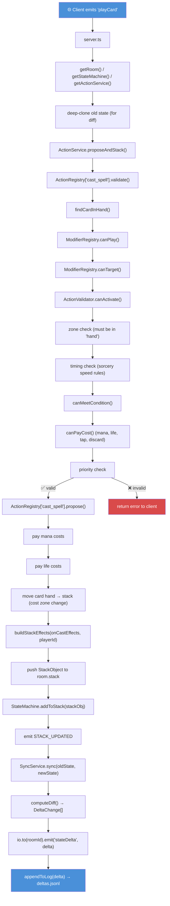
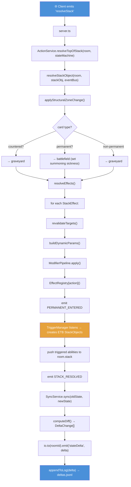
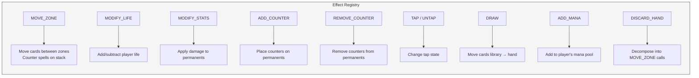
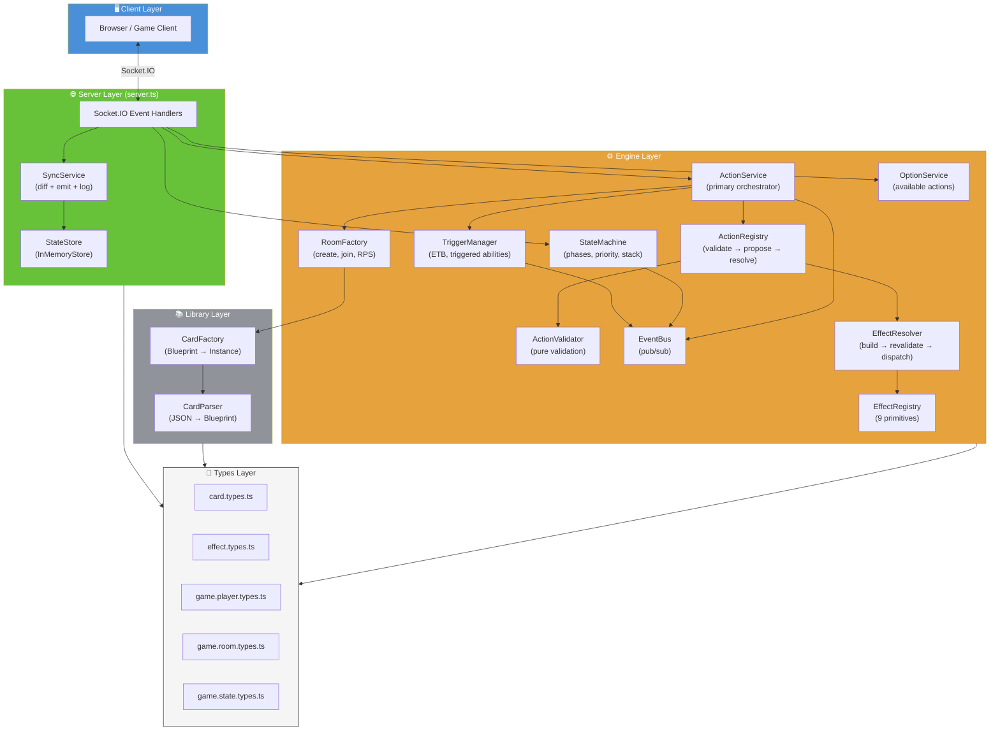

# Card Game Architecture Documentation (TypeScript)

**Date:** 2026-07-15
**Status:** Current

---

## 1. Overview

A multiplayer card game server built with TypeScript, Express, and Socket.IO. The architecture follows a strict layered design: **Types → Library → Engine → Server**. The engine has zero knowledge of sockets or HTTP — `server.ts` is the sole translation layer between network events and engine calls.

**Tech stack:** TypeScript, Express, Socket.IO, Vitest (testing), UUID generation.

**Key design principles:**
- Engine services are pure TypeScript — testable without network infrastructure
- State changes produce deltas — sent to clients and logged for replay
- Card effects decompose into ~9 atomic primitives (`MODIFY_STATS`, `DRAW`, `MOVE_ZONE`, etc.)
- Actions follow a 3-phase lifecycle: validate → propose → resolve
- `EventBus` decouples state transitions from side effects (triggers, UI sync)

---

## 2. Directory Map

```
src/
├── server.ts                          # Express + Socket.IO entry point; wires engine to network
├── types/                             # Pure type definitions — no runtime code
│   ├── card.types.ts                  # CardBlueprint, CardInstance, CardState, CardAbility, ManaColor
│   ├── effect.types.ts                # StackObject, StackEffect, ActionCost, TargetPointer, EffectDefinition
│   ├── game.player.types.ts           # PlayerState, ManaPool
│   ├── game.room.types.ts             # GameRoom — the central aggregate
│   └── game.state.types.ts            # GameStateName union, GameTransitionMap
├── library/                           # Card data loading and instantiation
│   ├── card-parser.ts                 # Raw JSON → typed CardBlueprint (normalization)
│   └── card-factory.ts               # Blueprint cache + CardInstance factory (deep-clone, UUID)
├── engine/                            # Core game logic — no socket/HTTP knowledge
│   ├── game-engine.ts                 # Thin orchestrator (legacy; see Points of Interest)
│   ├── action-service.ts              # Primary orchestrator: validate → propose → resolve stack
│   ├── action-registry.ts             # ActionHandler interface + ActionRegistry record
│   ├── action-validator.ts            # Static pure validation: canActivate, canPayCost, canMeetCondition
│   ├── state-machine.ts               # Turn phases, priority, stack LIFO; emits via EventBus
│   ├── event-bus.ts                   # In-memory pub/sub, room-scoped
│   ├── effect-registry.ts             # Primitive effect handlers (MOVE_ZONE, MODIFY_STATS, DRAW, etc.)
│   ├── effect-resolver.ts             # Resolution pipeline: build effects, revalidate targets, structural zone changes
│   ├── trigger-manager.ts             # Listens for PERMANENT_ENTERED, creates triggered StackObjects
│   ├── modifier-pipeline.ts           # Stub: value-transformation modifier chain
│   ├── modifier-registry.ts           # Stub: permission-check modifiers (hexproof, etc.)
│   ├── option-service.ts              # Computes available actions for a card in a zone
│   ├── room-factory.ts                # Static factory: create rooms, join players, setup RPS
│   └── handlers/
│       └── play-card-handler.ts       # cast_spell handler: validate → propose (pay costs, build StackObject)
├── server/                            # Persistence and client sync
│   ├── state-store.ts                 # StateStore interface + InMemoryStore (Map-based)
│   └── sync-service.ts               # State diffing, delta emission, JSONL logging
data/
└── card_data.json                     # Raw card definitions (at project root)
```

---

## 3. Layer 1: Types (`src/types/`)

The type layer defines the data model. Files form a clean dependency hierarchy with no circular imports.

```
card.types.ts  ←  effect.types.ts  ←  game.player.types.ts  ←  game.room.types.ts
                                                              ←  game.state.types.ts
```

### 3.1 `card.types.ts` — Foundation

Defines the card domain primitives and the two-level card model:

| Type | Purpose |
|---|---|
| `ManaColor`, `ManaCost` | Mana system primitives |
| `CardType`, `CardSubType`, `CardZone` | Card classification and location |
| `TriggerEvent` | Union of game events that trigger abilities (`ON_ENTER_BATTLEFIELD`, `ON_DIE`, etc.) |
| `ActivatedAbility` / `TriggeredAbility` | Discriminated union for card abilities |
| `CardBlueprint` | Static card definition (id, name, types, cost, abilities, effects) |
| `CardState` | Runtime mutable state (zone, tapped, damage, counters, summoning sickness) |
| `CardInstance` | `CardBlueprint` + `uuid` + `CardState` — the runtime card object |

### 3.2 `effect.types.ts` — Stack & Action System

Depends on `card.types.ts`. Defines the contracts between card definitions and the engine:

| Type | Purpose |
|---|---|
| `ActionType`, `EffectId` | Registry key types (open strings) |
| `ActionSpeed`, `StackItemType`, `TargetType` | Speed/stack/target enums |
| `ActionCost` | Resource costs (mana, tap, life, discard, sacrifice) |
| `ActionCondition` | State conditions (zone checks, global flags) |
| `ActionRequirements` | Combined cost + condition + zone + speed rules |
| `TargetPointer` | Flexible target reference (player, card, permanent, stack, zone) |
| `EffectDefinition` | Card-data-level effect (action + params + targeting) |
| `StackEffect` | Resolve-time effect with locked targets and dynamic params |
| `StackObject` | A stack item: spell/activated/triggered with source card and effects array |

### 3.3 `game.player.types.ts` — Player State

Simple runtime player data: `PlayerState` (id, life, `ManaPool`, deck/hand/graveyard arrays).

### 3.4 `game.room.types.ts` — Central Aggregate

`GameRoom` composes all other types into the game state root:

```
GameRoom {
    roomId, player1Id, player2Id
    players: Record<PlayerId, PlayerState>   // all player data
    currentPhase: GameStateName
    activeTurnPlayerId, priorityPlayerId, lastPassedPlayerId
    battlefield: CardInstance[]
    stack: StackObject[]
    rpsState: { status, playedCards }
}
```

### 3.5 `game.state.types.ts` — State Machine

`GameStateName` union: `waiting | RPS | stateTurnStart | stateDrawPhase | stateMainPhase | stateBattlePhase | endCombat | stateEndPhase | cleanupStep | Stack | gameOver`. Plus `GameTransitionMap` for valid transitions.

---

## 4. Layer 2: Library (`src/library/`)

Bridges raw JSON card data to typed runtime instances.

### 4.1 `card-parser.ts`

Pure normalization functions. Converts raw JSON objects from `card_data.json` into typed structures:

- `normalizeActionCost()` — raw cost → `ActionCost` with defaults
- `normalizeEffect()` — raw effect → `EffectDefinition`
- `normalizeAbility()` — raw ability → `ActivatedAbility | TriggeredAbility`
- `normalizeCard()` — raw card → `CardBlueprint` (throws on missing `id`)
- `parseAll()` — bulk parse of entire card map

### 4.2 `card-factory.ts`

Caching and instantiation:

- `getBlueprint()` — parses once, caches in `blueprintCache`
- `instantiateCard()` — deep-clones a blueprint into a `CardInstance` with fresh UUID and default `CardState`. Deep-clones abilities and costs to prevent shared-reference bugs.

**Data flow:** `card_data.json` → `card-parser.ts` → `CardBlueprint` (cached) → `card-factory.ts` → `CardInstance` (runtime)

---

## 5. Layer 3: Engine (`src/engine/`)

The core game logic. All engine files work with plain TypeScript types — no socket, HTTP, or I/O knowledge.

### 5.1 Orchestration & Lifecycle

#### `action-service.ts` — Primary Orchestrator

The main entry point used by `server.ts`. Responsibilities:
- Route client actions to `ActionRegistry` (validate → propose)
- Manage stack resolution (structural zone change + effect resolution + triggers)
- Wire per-room `TriggerManager` for ETB/triggered abilities
- Emit events via `EventBus`

Key methods:
- `initRoom(room)` — creates `TriggerManager` for the room
- `handleAction(room, playerId, actionType, actionData)` — validate → propose pipeline
- `proposeAndStack(room, playerId, actionType, actionData, stateMachine)` — full propose + stack sync
- `resolveTopOfStack(room, stateMachine?)` — pop stack, resolve via `resolveStackObject()`

#### `game-engine.ts` — Legacy Orchestrator

Near-identical to `ActionService` but with its own `EventBus` management. Used in tests. See Points of Interest (Section 9).

#### `state-machine.ts` — Turn & Priority Engine

Manages game phases, turn order, and the priority system. Emits events via `EventBus`:
- `PHASE_CHANGED` — on phase transition
- `TURN_SWITCHED` — on turn change
- `PRIORITY_GIVEN` — when a player receives priority

Key state:
- `currentPhase`, `previousPhase` — phase tracking
- `currentPlayer`, `priorityPlayer`, `lastPlayerToPass` — turn/priority tracking
- `stack: StackObject[]` — local stack copy
- `stackOpen` — whether new items can be added to stack

Valid transitions are defined in `TRANSITIONS` map. The `Stack` pseudo-phase saves `previousPhase` for return after resolution.

### 5.2 Action Pipeline

#### `action-registry.ts` — Handler Interface & Registry

Defines the 3-phase action lifecycle:

```
validate(room, playerId, action) → ActionResult  // permission checks, cost validation
propose(room, playerId, action)  → ActionResult  // pay costs, create StackObject, push to stack
resolve(room, stackObj)          → ActionResult  // apply effects via EffectRegistry
```

`ActionRegistry` is a `Record<ActionType, ActionHandler>`. Handlers are registered by string key (e.g., `'cast_spell'`).

#### `action-validator.ts` — Pure Validation

Static utility class with no side effects:

- `canActivate(room, playerId, card, req)` — master validation pipeline:
  1. Zone eligibility
  2. Timing/speed constraints (sorcery vs instant)
  3. State conditions (`canMeetCondition`)
  4. Resource costs (`canPayCost`)
  5. Priority check
- `canMeetCondition(room, playerId, condition?)` — zone checks (card count, type, ID), global flags
- `canPayCost(room, playerId, card, cost?)` — mana, life, tap state, discard checks

#### `handlers/play-card-handler.ts` — Cast Spell Handler

The concrete `ActionHandler` for `'cast_spell'`. Implements all 3 phases:

- **validate:** card in hand, modifier checks, `ActionValidator.canActivate()`
- **propose:** pay mana/life costs, move card hand→stack (cost zone change), build `StackObject` with `buildStackEffects()`, push to `room.stack`
- **resolve:** delegated to the orchestrator's `resolveTopOfStack()`

**Cost vs Effect zone changes:** The hand→stack move in `propose()` is a *cost* — it happens immediately and cannot be countered. The stack→battlefield/graveyard move in `applyStructuralZoneChange()` is a *structural game rule* applied at resolution.

### 5.3 Effect Resolution

#### `effect-registry.ts` — Primitive Handlers

Maps primitive names to handler functions: `(room, stackObj, effect) => void`.

| Primitive | Purpose |
|---|---|
| `MOVE_ZONE` | Move cards between zones; counter spells on stack |
| `MODIFY_LIFE` | Add/subtract player life |
| `MODIFY_STATS` | Apply damage to permanents (P/T changes tracked for modifier system) |
| `ADD_COUNTER` | Place counters on permanents |
| `REMOVE_COUNTER` | Remove counters from permanents |
| `TAP` / `UNTAP` | Change tap state |
| `DRAW` | Move cards from library to hand |
| `ADD_MANA` | Add to player's mana pool |
| `DISCARD_HAND` | Convenience: decomposes into individual MOVE_ZONE calls |

Also contains zone utility helpers: `findCardOnBattlefield()`, `findCardInZone()`, `removeFromZone()`, `addToZone()`.

#### `effect-resolver.ts` — Resolution Pipeline

The full resolution sequence for a `StackObject`:

1. **`buildStackEffects()`** — converts `EffectDefinition[]` from card data into `StackEffect[]` with auto-filled self-targets
2. **`applyStructuralZoneChange()`** — game rule: permanents → battlefield, non-permanents → graveyard, countered → graveyard
3. **`revalidateTargets()`** — filters out targets no longer legal at resolve time (e.g., creature bounced after spell cast)
4. **`buildDynamicParams()`** — computes values that change between propose and resolve (e.g., `DYNAMIC:source.power`)
5. **`resolveEffects()`** — dispatches each effect to `EffectRegistry`, running modifier pipeline and revalidation per effect
6. **`resolveStackObject()`** — full orchestration: zone change → effects → `PERMANENT_ENTERED` event → `STACK_RESOLVED` event

#### `trigger-manager.ts` — Triggered Abilities

Created per-room by `ActionService.initRoom()`. Listens on the room's `EventBus`:
- `PERMANENT_ENTERED` → reads `onEnterEffects` from the card, builds a triggered `StackObject`, pushes to `room.stack`
- Future: `PERMANENT_LEFT`, `LIFE_CHANGED`, `TURN_STARTED`, `PHASE_CHANGED`

### 5.4 Support Services

#### `event-bus.ts` — Pub/Sub

Room-scoped in-memory event bus. `emit()`, `on()`, `off()`. Used by `StateMachine` (emits phase/priority events), `TriggerManager` (listens for game events), and `ActionService` (emits action events).

#### `option-service.ts` — Action Options

Computes available actions for a card in a given zone (`hand` or `battlefield`):
- Hand cards → "Play Card" (validated via `ActionValidator.canActivate()`)
- Battlefield lands → "Tap for Mana"
- Battlefield permanents → activated abilities from card definition

Returns `ActionOption[]` with `disabled`/`disabledReason` for the client UI.

#### `room-factory.ts` — Room Factory

Static factory for `GameRoom` lifecycle:
- `createRoom()` — initial blank room with player 1
- `joinRoom()` — adds player 2
- `setupRPS()` — deals Rock/Paper/Scissors cards
- `dealStartingHands()` — clears RPS, deals 4 cards each

#### `modifier-pipeline.ts` — Stub

Intended for value-transformation modifiers (cost reducers, flash granters, target modifiers). Currently identity transform — returns effect unchanged.

#### `modifier-registry.ts` — Stub

Intended for permission-check modifiers (hexproof, shroud, "can't play creatures"). Currently all checks pass through.

---

## 6. Layer 4: Server (`src/server/`)

### 6.1 `state-store.ts` — Persistence

`StateStore` interface with `InMemoryStore` implementation (backed by `Map<string, GameRoom>`). Designed for future Redis swap via same interface.

### 6.2 `sync-service.ts` — Client Sync

Computes diffs between old and new `GameRoom` states, emits `StateDelta` to all clients in the room via Socket.IO, and appends to a JSONL delta log for replay/debugging. Sequence-numbered per room.

---

## 7. Entry Point: `server.ts`

Express + Socket.IO wiring. The only file with socket or HTTP knowledge.

**Per-room engine instances** (created lazily via `getOrCreateEngine()`):
- `EventBus` — one per room
- `StateMachine` — one per room
- `ActionService` — one per room
- `OptionService` — singleton (stateless)

**Socket events handled:**
| Event | Handler |
|---|---|
| `createRoom` | Create room, init engine, emit `roomCreated` |
| `joinRoom` | Add player 2, setup RPS, emit `startGame` / `rpsPhase` |
| `nextState` | Advance phase, sync |
| `endTurn` | Transition through end→cleanup→turnStart, switch turn, sync |
| `GetOptionsForCard` | Delegate to `OptionService`, emit `OptionsForCard` |
| `playCard` | Delegate to `ActionService.proposeAndStack()`, sync |
| `resolveStack` | Delegate to `ActionService.resolveTopOfStack()`, sync |
| `passPriority` | Delegate to `StateMachine.passPriority()`, sync |

---

## 8. Data Flow: Play Card End-to-End

### 8.1 Propose Phase (Client → Stack)



### 8.2 Resolve Phase (Stack → Battlefield)



### 8.3 Effect Registry Primitives



### 8.4 Full System Architecture



---

## 9. Points of Interest

The following areas warrant deeper investigation. They are not necessarily bugs, but structural choices that may benefit from review as the codebase evolves.

### 9.1 Dual Orchestrators: `GameEngine` vs `ActionService`

`GameEngine` and `ActionService` have nearly identical `handleAction()` and `resolveTopOfStack()` methods. `GameEngine` manages its own `EventBus` internally; `ActionService` receives one via constructor. `server.ts` uses `ActionService` exclusively. `GameEngine` appears to exist for backward-compatible testing.

**Question to resolve:** Should `GameEngine` be removed in favor of `ActionService`, or is there a planned divergence?

### 9.2 Dual Stack State

Both `GameRoom.stack` and `StateMachine.stack` maintain separate stack arrays. `ActionService.resolveTopOfStack()` pops from both independently. `play-card-handler.ts` pushes only to `room.stack`, then `ActionService.proposeAndStack()` syncs to `stateMachine.stack`.

**Question to resolve:** Should `StateMachine` read/write `GameRoom.stack` directly instead of maintaining its own copy?

### 9.3 StateMachine Owns Duplicate GameRoom Fields

`StateMachine` holds `currentPhase`, `currentPlayer`, `priorityPlayer`, `lastPlayerToPass`, and `stack` — all of which are also fields on `GameRoom`. After every operation, `server.ts` manually syncs them:

```ts
room.currentPhase = sm.currentPhase;
room.priorityPlayerId = sm.priorityPlayer;
room.lastPassedPlayerId = sm.lastPlayerToPass;
```

**Question to resolve:** Should `StateMachine` operate directly on a `GameRoom` reference, or should `GameRoom` be the single source of truth that `StateMachine` reads?

### 9.4 `room-factory.ts` Uses Static-Only Class

All methods are `public static`. The class provides no instance state and is never instantiated. This is effectively a namespace.

**Question to resolve:** Convert to exported functions or a plain namespace/object?

### 9.5 Stub Modifiers in the Critical Path

`ModifierRegistry` and `ModifierPipeline` are called in the validate/propose/resolve pipeline but are no-ops. This is intentional scaffolding, but the placeholder calls add indirection without value until implemented.

**Question to resolve:** Is there a timeline for implementing the modifier system? If distant, consider whether the stubs should remain inline or be extracted behind a feature flag.

### 9.6 `TriggerManager` Lifecycle

`TriggerManager` is created in `ActionService.initRoom()` but the reference is discarded. It works because it registers listeners on the `EventBus`, but there is no way to clean up or inspect it. If a room is destroyed, the listener leaks.

**Question to resolve:** Should `ActionService` hold a reference and provide a `destroyRoom()` method that unregisters listeners?

### 9.7 `server.ts` Growing Responsibilities

At ~270 lines, `server.ts` mixes room lifecycle, RPS logic, turn management, card actions, and priority handling. As more socket events are added, this file will become harder to maintain.

**Question to resolve:** Should socket event handlers be extracted into separate handler files (e.g., `src/server/handlers/room-handlers.ts`, `src/server/handlers/game-handlers.ts`)?

### 9.8 `ActionValidator` is All-Static

`ActionValidator` has no instance state — all methods are `public static`. This makes it hard to mock in tests and prevents dependency injection if validation ever needs configuration.

**Question to resolve:** Is the static design intentional (pure functions, no config needed), or should it be an injectable service?

---

## 10. Relationship to Legacy JS Codebase

The root-level `.js` files (`server.js`, `gameLogic.js`, `socketHandlers.js`, `stateMachine.js`, `library.js`, `decks.js`) are the pre-refactor codebase. The TypeScript code in `src/` is the redesigned replacement. Key architectural changes:

| Concept | Legacy JS | TypeScript |
|---|---|---|
| Card effects | Inline functions with wrapper system | Declarative `EffectDefinition[]` → `StackEffect[]` |
| Effect execution | Collected effects + emits objects | `EffectRegistry` primitive dispatch |
| State management | Global `rooms` object | `StateStore` interface (InMemoryStore) |
| Client sync | Direct socket emissions in handlers | `SyncService` with diff computation |
| Socket coupling | Engine files import socket.io | Only `server.ts` knows about sockets |
| Targeting | Ad-hoc | `TargetPointer` with resolve-time revalidation |
| Stack | Simple array | `StackObject` with per-effect targets, countered flag, dynamic params |
