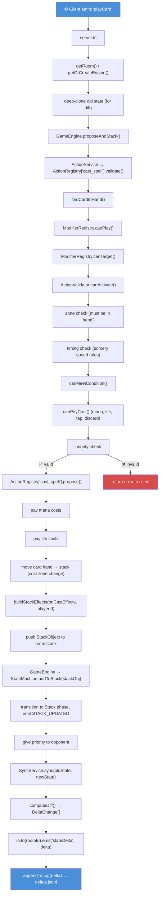
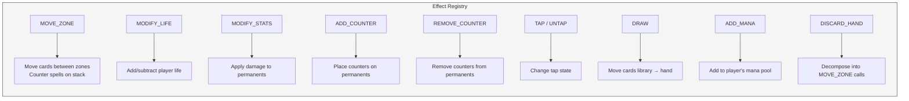
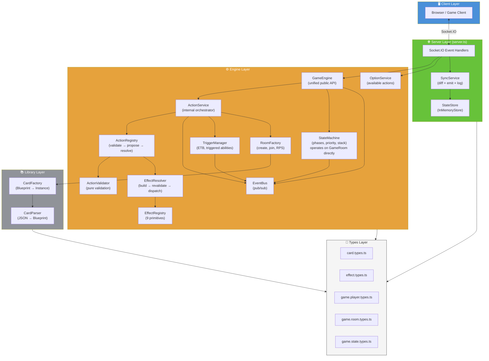

# Card Game Architecture Documentation (TypeScript)

**Date:** 2026-07-23
**Status:** Current

---

## 1. Overview

A multiplayer card game server built with TypeScript, Express, and Socket.IO. The architecture follows a strict layered design: **Types → Library → Engine → Server**. The engine has zero knowledge of sockets or HTTP — `server.ts` is the sole translation layer between network events and engine calls.

**Tech stack:** TypeScript 6.0, Express 4.21, Socket.IO 4.8, Vitest 4.1 (testing), UUID 11.0.

**Key design principles:**
- `GameEngine` is the **single unified public API** — `server.ts` talks only to it; it owns and coordinates `EventBus`, `StateMachine`, and `ActionService` internally
- Engine services are pure TypeScript — testable without network infrastructure
- State changes produce deltas — sent to clients and logged for replay
- Card effects decompose into 9 atomic primitives (`MODIFY_STATS`, `DRAW`, `MOVE_ZONE`, etc.)
- Actions follow a 3-phase lifecycle: validate → propose → resolve
- `EventBus` decouples state transitions from side effects (triggers, UI sync)

### 1.1 Functional Game Flows (Implemented)

| Flow | Status | Description |
|---|---|---|
| Room lifecycle | ✅ Full | Create room, join room, RPS mini-game, deal starting hands |
| Turn structure | ✅ Full | Phases: TurnStart (untap) → Draw → Main → Battle → End → Cleanup → next turn |
| Play card (cast spell) | ✅ Full | Validate → pay costs → hand→stack → resolve → battlefield/graveyard |
| Attack | ✅ Full | Validate (untapped, no sickness, battle phase) → tap as cost → stack damage → resolve |
| Tap for mana | ✅ Full | Validate → tap permanent → add mana (does NOT use stack — mana ability; works for Lands and any permanent with a pure `ADD_MANA` ability) |
| Stack resolution | ✅ Full | LIFO pop → structural zone change → revalidate targets → dynamic params → dispatch effects → ETB/death triggers → **on empty, returns to `previousPhase` and restores priority to the active player** (`resolveTopOfStack` → `resolveCurrentPhase`; `TRANSITIONS['Stack']` gains return edges) |
| ETB triggers | ✅ Full | `PERMANENT_ENTERED` → `TriggerManager` creates triggered `StackObject` → pushed to stack |
| Priority system | ✅ Full | Active player → opponent → both pass → resolve stack/phase |
| State sync | ✅ Full | Deep-clone diff → `StateDelta` → Socket.IO emit + JSONL log |
| Target revalidation | ✅ Full | Targets checked at resolve time; illegal targets filtered out |
| Dynamic params | ✅ Full | `DYNAMIC:source.power` etc. resolved at execution time |
| Countering (structural) | ✅ Partial | `countered` flag on `StackObject` → skips effects, sends to graveyard. `counterStackObject()` action lets the priority holder counter the top (or a specific) stack object; no counter-spell card with a mana cost yet. |

### 1.2 Stubs & Planned Features

| Area | Status | Description |
|---|---|---|
| Modifier system | 🔶 Stub | `ModifierRegistry` (permission checks: hexproof, shroud) and `ModifierPipeline` (value transforms: cost reduction, flash) are identity/no-op stubs |
| P/T modification | ✅ Full | `MODIFY_STATS` applies power/toughness deltas via `SET_POWER_TOUGHNESS` (round-11; test: `power-toughness-mod.test.ts`) |
| Death/destroy triggers | ✅ Full | `applyMutations` emits `PERMANENT_LEFT` for departed battlefield creatures → `TriggerManager` fires `ON_DIE` / `ON_LEAVE_BATTLEFIELD` → triggered `StackObject` pushed & resolved (round-13 test: `death-trigger.test.ts`) |
| Life-gain triggers | ✅ Full | `applyMutations` snapshots life totals before a batch and emits `LIFE_CHANGED` when a player's life increased → `TriggerManager` fires `ON_LIFE_GAIN` for the gaining player's permanents (round-17 test: `life-gain-trigger.test.ts`) |
| Upkeep/phase triggers | 🔶 Partial | `TURN_SWITCHED` → `TriggerManager` fires `BEGIN_UPKEEP` for the incoming active player's permanents (round-15 test: `upkeep-trigger.test.ts`); `TURN_ENDING` → fires `END_OF_TURN` for the outgoing player's permanents (round-16 test: `end-of-turn-trigger.test.ts`). `PHASE_CHANGED` (beginning-of-combat) not yet wired |
| Activated abilities (non-mana) | 🔶 Partial | `OptionService` computes options; no handler registered for generic activated abilities |
| Multi-target selection | ❌ Not started | Server-prompted targeting (client chooses targets before propose) |
| Counter-spell card | ❌ Not started | No card with counter effect defined; `MOVE_ZONE` counter logic exists in `EffectRegistry` |
| Graveyard interaction | ❌ Not started | No cards or effects that interact with graveyard |
| Enchantments/Artifacts | ❌ Not started | Types defined; no cards or attachment logic |
| Room cleanup/destroy | ❌ Not started | `TriggerManager` listener leaks if room destroyed; no `destroyRoom()` |
| Server handler extraction | ❌ Not started | `server.ts` at ~280 lines; socket handlers not yet extracted to separate files |

---

## 2. Directory Map

```
src/
├── server.ts                          # Express + Socket.IO entry point; wires GameEngine to network
├── types/                             # Pure type definitions — no runtime code
│   ├── card.types.ts                  # CardBlueprint, CardInstance, CardState, CardAbility, ManaColor
│   ├── effect.types.ts                # StackObject, StackEffect, ActionCost, TargetPointer, EffectDefinition
│   ├── game.player.types.ts           # PlayerState, ManaPool
│   ├── game.room.types.ts             # GameRoom — the central aggregate
│   └── game.state.types.ts            # GameStateName union, GameTransitionMap
├── library/                           # Card data loading and instantiation
│   ├── card_data.json                 # Raw card definitions (the active data file)
│   ├── card-parser.ts                 # Raw JSON → typed CardBlueprint (normalization)
│   └── card-factory.ts               # Blueprint cache + CardInstance factory (deep-clone, UUID)
├── engine/                            # Core game logic — no socket/HTTP knowledge
│   ├── game-engine.ts                 # Unified public API: owns EventBus, StateMachine, ActionService
│   ├── action-service.ts              # Internal orchestrator: validate → propose → resolve stack
│   ├── action-registry.ts             # ActionHandler interface + ActionRegistry record
│   ├── action-validator.ts            # Static pure validation: canActivate, canPayCost, canMeetCondition
│   ├── mana-pool.ts                   # Centralized mana pool operations (canPay, add, spend, drain, isPureAbility)
│   ├── state-machine.ts               # Turn phases, priority, stack LIFO; operates on GameRoom directly
│   ├── event-bus.ts                   # In-memory pub/sub, room-scoped
│   ├── effect-registry.ts             # Primitive effect handlers (MOVE_ZONE, MODIFY_STATS, DRAW, etc.)
│   ├── effect-resolver.ts             # Resolution pipeline: build effects, revalidate targets, structural zone changes
│   ├── trigger-manager.ts             # Listens for PERMANENT_ENTERED, creates triggered StackObjects
│   ├── modifier-pipeline.ts           # Stub: value-transformation modifier chain
│   ├── modifier-registry.ts           # Stub: permission-check modifiers (hexproof, etc.)
│   ├── option-service.ts              # Computes available actions for a card in a zone
│   ├── room-factory.ts                # Exported functions: createRoom, joinRoom, setupRPS, dealStartingHands
│   └── handlers/
│       ├── play-card-handler.ts       # cast_spell: validate → propose (pay costs, build StackObject)
│       ├── attack-handler.ts          # attack: validate → propose (tap creature, push damage to stack)
│       └── tap-for-mana-handler.ts    # tapForMana: validate → propose (tap land, add mana; no stack)
├── server/                            # Persistence and client sync
│   ├── state-store.ts                 # StateStore interface + InMemoryStore (Map-based)
│   └── sync-service.ts               # State diffing, delta emission, JSONL logging
data/
└── card_data.json.bak                 # Legacy card data backup (pre-refactor)
tests/
├── engine/                            # Engine unit + integration tests (12 test files)
│   ├── game-engine.test.ts            # Full turn loop integration test + GameEngine unit tests
│   ├── action-service.test.ts
│   ├── action-registry.test.ts
│   ├── action-validator.test.ts
│   ├── attack-handler.test.ts
│   ├── play-card-handler.test.ts
│   ├── effect-registry.test.ts
│   ├── effect-resolver.test.ts
│   ├── event-bus.test.ts
│   ├── option-service.test.ts
│   ├── state-machine.test.ts
│   └── trigger-manager.test.ts
├── helpers/
│   └── test-room-factory.ts           # createTestRoom(): standardized room setup for tests
└── server/
    ├── state-store.test.ts
    └── sync-service.test.ts
```

---

## 3. Layer 1: Types (`src/types/`)

The type layer defines the data model. Files form a clean dependency hierarchy with no circular imports.

```
card.types.ts  ←  effect.types.ts  ←  game.player.types.ts  ←  game.room.types.ts
                                                              ←  game.state.types.ts
```

### 3.1 `card.types.ts` — Foundation

Defines the card domain primitives and the two-level card model:

| Type | Purpose |
|---|---|
| `ManaColor`, `ManaCost` | Mana system primitives |
| `CardType`, `CardSubType`, `CardZone` | Card classification and location |
| `TriggerEvent` | Union of game events that trigger abilities (`ON_ENTER_BATTLEFIELD`, `ON_DIE`, etc.) |
| `ActivatedAbility` / `TriggeredAbility` | Discriminated union for card abilities |
| `CardBlueprint` | Static card definition (id, name, types, cost, abilities, effects) |
| `CardState` | Runtime mutable state (zone, tapped, damage, counters, summoning sickness) |
| `CardInstance` | `CardBlueprint` + `uuid` + `CardState` — the runtime card object |

### 3.2 `effect.types.ts` — Stack & Action System

Depends on `card.types.ts`. Defines the contracts between card definitions and the engine:

| Type | Purpose |
|---|---|
| `ActionType`, `EffectId` | Registry key types (open strings) |
| `ActionSpeed`, `StackItemType`, `TargetType` | Speed/stack/target enums |
| `ActionCost` | Resource costs (mana, tap, life, discard, sacrifice) |
| `ActionCondition` | State conditions (zone checks, global flags) |
| `ActionRequirements` | Combined cost + condition + zone + speed rules |
| `TargetPointer` | Flexible target reference (player, card, permanent, stack, zone) |
| `EffectDefinition` | Card-data-level effect (action + params + targeting) |
| `StackEffect` | Resolve-time effect with locked targets and dynamic params |
| `StackObject` | A stack item: spell/activated/triggered with source card and effects array |

### 3.3 `game.player.types.ts` — Player State

Simple runtime player data: `PlayerState` (id, life, `ManaPool`, deck/hand/graveyard arrays).

### 3.4 `game.room.types.ts` — Central Aggregate

`GameRoom` composes all other types into the game state root:

```
GameRoom {
    roomId, player1Id, player2Id
    players: Record<PlayerId, PlayerState>   // all player data
    currentPhase: GameStateName
    activeTurnPlayerId, priorityPlayerId, lastPassedPlayerId
    battlefield: CardInstance[]
    stack: StackObject[]
    rpsState: { status, playedCards }
}
```

### 3.5 `game.state.types.ts` — State Machine

`GameStateName` union: `waiting | RPS | stateTurnStart | stateDrawPhase | stateMainPhase | stateBattlePhase | endCombat | stateEndPhase | cleanupStep | Stack | gameOver`. Plus `GameTransitionMap` for valid transitions.

---

## 4. Layer 2: Library (`src/library/`)

Bridges raw JSON card data to typed runtime instances.

### 4.1 `card-parser.ts`

Pure normalization functions. Converts raw JSON objects from `card_data.json` into typed structures:

- `normalizeActionCost()` — raw cost → `ActionCost` with defaults
- `normalizeEffect()` — raw effect → `EffectDefinition`
- `normalizeAbility()` — raw ability → `ActivatedAbility | TriggeredAbility`
- `normalizeCard()` — raw card → `CardBlueprint` (throws on missing `id`)
- `parseAll()` — bulk parse of entire card map

### 4.2 `card-factory.ts`

Caching and instantiation:

- `getBlueprint()` — parses once, caches in `blueprintCache`
- `instantiateCard()` — deep-clones a blueprint into a `CardInstance` with fresh UUID and default `CardState`. Deep-clones abilities and costs to prevent shared-reference bugs.

**Data flow:** `card_data.json` → `card-parser.ts` → `CardBlueprint` (cached) → `card-factory.ts` → `CardInstance` (runtime)

---

## 5. Layer 3: Engine (`src/engine/`)

The core game logic. All engine files work with plain TypeScript types — no socket, HTTP, or I/O knowledge.

### 5.1 Orchestration & Lifecycle

#### `game-engine.ts` — Unified Public API

**The single entry point for all engine operations.** `server.ts` talks only to `GameEngine` — no more juggling separate `EventBus`, `StateMachine`, and `ActionService` instances.

`GameEngine` owns and coordinates three internal services:
- `EventBus` — created per room in constructor
- `StateMachine` — receives `GameRoom` reference + `EventBus`; operates on room directly
- `ActionService` — receives `EventBus`; handles action pipeline and stack resolution

Key methods (all delegate internally):
- `initRoom()` — wires `TriggerManager` for ETB/triggered abilities
- `handleAction(playerId, actionType, actionData)` → `ActionResult` — validate → propose pipeline
- `proposeAndStack(playerId, actionType, actionData)` → `ActionResult` — propose + `StateMachine.addToStack()` for phase/priority sync
- `resolveTopOfStack()` → `ActionResult` — pop stack, resolve via `resolveStackObject()`
- `transition(to)` / `switchTurn()` / `isPlayerTurn()` — phase/turn delegation
- `givePriorityTo()` / `passPriority()` — priority delegation
- `phase`, `activeTurnPlayerId`, `priorityPlayerId` — accessors reading from `GameRoom`

#### `action-service.ts` — Internal Action Orchestrator

An internal delegate used by `GameEngine` (not called directly by `server.ts`). Responsibilities:
- Route client actions to `ActionRegistry` (validate → propose)
- Manage stack resolution (structural zone change + effect resolution + triggers)
- Wire per-room `TriggerManager` for ETB/triggered abilities (reference held for future cleanup)
- Emit events via `EventBus`

Key methods:
- `initRoom(room)` — creates `TriggerManager` for the room, stores reference
- `handleAction(room, playerId, actionType, actionData)` — validate → propose pipeline
- `proposeAndStack(room, playerId, actionType, actionData)` — full propose (stack sync handled by caller)
- `resolveTopOfStack(room)` — pop stack, resolve via shared `resolveStackObject()`

#### `state-machine.ts` — Turn & Priority Engine

Manages game phases, turn order, and the priority system. **Operates directly on a `GameRoom` reference** — no duplicate fields. Reads/writes `room.currentPhase`, `room.activeTurnPlayerId`, `room.priorityPlayerId`, `room.lastPassedPlayerId`, and `room.stack` directly.

Emits events via `EventBus`:
- `PHASE_CHANGED` — on phase transition
- `TURN_SWITCHED` — on turn change
- `PRIORITY_GIVEN` — when a player receives priority
- `STACK_UPDATED` — when a new item is added to the stack

Key state (non-duplicated):
- `previousPhase` — saved when entering `Stack` pseudo-phase for return after resolution
- `waitingForResponse` — whether waiting for player action
- `stackOpen` — whether new items can be added to stack

Key methods:
- `transition(to)` — validates via `TRANSITIONS` map, handles untap step on `stateTurnStart`, emits `PHASE_CHANGED`
- `switchTurn()` — toggles `room.activeTurnPlayerId`, emits `TURN_SWITCHED`
- `addToStack(stackObj)` — transitions to `Stack` phase if needed, emits `STACK_UPDATED`, gives priority to opponent
- `passPriority(playerId)` — tracks consecutive passes; resolves phase/stack when both pass
- `resolveCurrentPhase()` — returns from `Stack` to `previousPhase`, or advances turn

Valid transitions are defined in `TRANSITIONS` map. The `Stack` pseudo-phase saves `previousPhase` for return after resolution. The untap step (untap all permanents, reset mana pool via `ManaPool.drain()`) runs automatically on `stateTurnStart` transition.

### 5.2 Action Pipeline

#### `action-registry.ts` — Handler Interface & Registry

Defines the 3-phase action lifecycle:

```
validate(room, playerId, action) → ActionResult  // permission checks, cost validation
propose(room, playerId, action)  → ActionResult  // pay costs, create StackObject, push to stack
resolve(room, stackObj)          → ActionResult  // apply effects via EffectRegistry
```

`ActionRegistry` is a `Record<ActionType, ActionHandler>`. Handlers are registered by string key (e.g., `'cast_spell'`).

#### `action-validator.ts` — Pure Validation

Static utility class with no side effects:

- `canActivate(room, playerId, card, req)` — master validation pipeline:
  1. Zone eligibility
  2. Timing/speed constraints (sorcery vs instant)
  3. State conditions (`canMeetCondition`)
  4. Resource costs (`canPayCost`)
  5. Priority check
- `canMeetCondition(room, playerId, condition?)` — zone checks (card count, type, ID), global flags
- `canPayCost(room, playerId, card, cost?)` — mana (via `ManaPool.canPay()`), life, tap state, discard checks

#### `handlers/play-card-handler.ts` — Cast Spell Handler

The concrete `ActionHandler` for `'cast_spell'`. Implements all 3 phases:

- **validate:** card in hand, modifier checks, `ActionValidator.canActivate()`
- **propose:** pay mana/life costs (mana via `ManaPool.spend()`), move card hand→stack (cost zone change), build `StackObject` with `buildStackEffects()`, push to `room.stack`
- **resolve:** delegated to the orchestrator's `resolveTopOfStack()`

**Cost vs Effect zone changes:** The hand→stack move in `propose()` is a *cost* — it happens immediately and cannot be countered. The stack→battlefield/graveyard move in `applyStructuralZoneChange()` is a *structural game rule* applied at resolution.

#### `handlers/attack-handler.ts` — Attack Handler

The concrete `ActionHandler` for `'attack'`. Registered in `server.ts` via `registerAction('attack', attackHandler)`.

- **validate:** must be player's turn, must be battle phase, creature must be on battlefield, untapped, no summoning sickness, must be a Creature type
- **propose:** tap the creature as cost (immediate, cannot be responded to), build `StackObject` with a `MODIFY_LIFE` effect targeting the opponent for `-power` damage, push to `room.stack`
- **resolve:** delegated to the orchestrator's `resolveTopOfStack()`

This design puts combat damage on the stack, allowing the opponent to respond (e.g., with instants) before damage resolves.

#### `handlers/tap-for-mana-handler.ts` — Mana Ability Handler

The concrete `ActionHandler` for `'tapForMana'`. Registered in `server.ts` via `registerAction('tapForMana', tapForManaHandler)`.

- **validate:** card must be on battlefield, must be untapped, no summoning sickness. Lands are always valid mana sources; non-lands must have a pure `ADD_MANA` activated ability (checked via `ManaPool.isPureAbility()`).
- **propose:** tap the permanent, read the first pure `ADD_MANA` activated ability from the card definition, add mana directly to player's pool via `ManaPool.add()`. Lands without an explicit ability fall back to `{colorless: 1}`. **Does NOT use the stack** — this is a mana ability (like MTG), resolving immediately without opportunity for response.
- **resolve:** no-op (effect already applied in propose)

This handler is now generalized: any permanent with a pure mana ability (e.g., mana artifacts, mana creatures) can tap for mana, not just Lands.

### 5.3 Effect Resolution

#### `effect-registry.ts` — Primitive Handlers

Maps primitive names to handler functions: `(room, stackObj, effect) => void`.

| Primitive | Purpose |
|---|---|
| `MOVE_ZONE` | Move cards between zones; counter spells on stack |
| `MODIFY_LIFE` | Add/subtract player life |
| `MODIFY_STATS` | Apply damage to permanents (P/T changes tracked for modifier system) |
| `ADD_COUNTER` | Place counters on permanents |
| `REMOVE_COUNTER` | Remove counters from permanents |
| `TAP` / `UNTAP` | Change tap state |
| `DRAW` | Move cards from library to hand |
| `ADD_MANA` | Add to player's mana pool (via `ManaPool.add()`) |
| `DISCARD_HAND` | Convenience: decomposes into individual MOVE_ZONE calls |

Also contains zone utility helpers: `findCardOnBattlefield()`, `findCardInZone()`, `removeFromZone()`, `addToZone()`.

#### `effect-resolver.ts` — Resolution Pipeline

The full resolution sequence for a `StackObject`:

1. **`buildStackEffects()`** — converts `EffectDefinition[]` from card data into `StackEffect[]` with auto-filled self-targets
2. **`applyStructuralZoneChange()`** — game rule: permanents → battlefield, non-permanents → graveyard, countered → graveyard
3. **`revalidateTargets()`** — filters out targets no longer legal at resolve time (e.g., creature bounced after spell cast)
4. **`buildDynamicParams()`** — computes values that change between propose and resolve (e.g., `DYNAMIC:source.power`)
5. **`resolveEffects()`** — dispatches each effect to `EffectRegistry`, running modifier pipeline and revalidation per effect
6. **`resolveStackObject()`** — full orchestration: zone change → effects → `PERMANENT_ENTERED` event → `STACK_RESOLVED` event

#### `trigger-manager.ts` — Triggered Abilities

Created per-room by `ActionService.initRoom()`. Listens on the room's `EventBus`:
- `PERMANENT_ENTERED` → reads `onEnterEffects` from the card, builds a triggered `StackObject`, pushes to `room.stack`
- `PERMANENT_LEFT` → engine's `applyMutations` fires it for departed battlefield creatures → `TriggerManager` fires `ON_DIE` / `ON_LEAVE_BATTLEFIELD`
- `TURN_SWITCHED` / `TURN_ENDING` → `TriggerManager` fires `BEGIN_UPKEEP` / `END_OF_TURN`
- `LIFE_CHANGED` → engine detects a player's life gain across a mutation batch → `TriggerManager` fires `ON_LIFE_GAIN`
- Future: `PHASE_CHANGED` (beginning-of-combat), `TURN_STARTED`

### 5.4 Support Services

#### `event-bus.ts` — Pub/Sub

Room-scoped in-memory event bus. `emit()`, `on()`, `off()`. Used by `StateMachine` (emits phase/priority events), `TriggerManager` (listens for game events), and `ActionService` (emits action events).

#### `option-service.ts` — Action Options

Computes available actions for a card in a given zone (`hand` or `battlefield`):
- Hand cards → "Play Card" (validated via `ActionValidator.canActivate()`)
- Battlefield lands or permanents with a pure mana ability → "Tap for Mana" (checked via `ManaPool.isPureAbility()`)
- Battlefield creatures → "Attack" (with summoning sickness / turn checks)
- Battlefield permanents → activated abilities from card definition

Returns `ActionOption[]` with `disabled`/`disabledReason` for the client UI.

#### `room-factory.ts` — Room Factory

Exported functions (converted from static-only class) for `GameRoom` lifecycle:
- `createRoom(roomId, player1Id)` → `GameRoom` — initial blank room with player 1
- `joinRoom(room, player2Id)` — adds player 2
- `setupRPS(room)` — deals Rock/Paper/Scissors cards to both players
- `dealStartingHands(room)` — clears RPS, deals 4 cards each from deck

#### `mana-pool.ts` — Centralized Mana Operations

All mana pool mutations route through a single `ManaPool` namespace. The pool itself remains a plain `Record<ManaColor, number>` on `PlayerState` — this module only centralizes the arithmetic so it isn't scattered across the engine.

| Function | Purpose |
|---|---|
| `canPay(pool, cost)` | Check if a pool can cover a `ManaCost` |
| `add(pool, color, amount)` | Add mana to a pool (mutates in place) |
| `spend(pool, cost)` | Deduct a cost from a pool (caller verifies with `canPay` first) |
| `drain(pool)` | Zero out the pool and return what was drained (for mana-burn / triggers) |
| `isPureAbility(effectId)` | True if an effect ID is a pure mana ability (`ADD_MANA`), eligible for atomic execution |

**Call sites:** `action-validator.ts` (`canPay`), `play-card-handler.ts` (`spend`), `tap-for-mana-handler.ts` (`add`, `isPureAbility`), `effect-registry.ts` (`add`), `state-machine.ts` (`drain`), `option-service.ts` (`isPureAbility`).

#### `modifier-pipeline.ts` — Stub

Intended for value-transformation modifiers (cost reducers, flash granters, target modifiers). Currently identity transform — returns effect unchanged.

#### `modifier-registry.ts` — Stub

Intended for permission-check modifiers (hexproof, shroud, "can't play creatures"). Currently all checks pass through.

---

## 6. Layer 4: Server (`src/server/`)

### 6.1 `state-store.ts` — Persistence

`StateStore` interface with `InMemoryStore` implementation (backed by `Map<string, GameRoom>`). Designed for future Redis swap via same interface.

### 6.2 `sync-service.ts` — Client Sync

Computes diffs between old and new `GameRoom` states, emits `StateDelta` to all clients in the room via Socket.IO, and appends to a JSONL delta log for replay/debugging. Sequence-numbered per room.

---

## 7. Entry Point: `server.ts`

Express + Socket.IO wiring (~280 lines). The only file with socket or HTTP knowledge.

**Per-room engine instances** (created lazily via `getOrCreateEngine()`):
- `GameEngine` — one per room (owns `EventBus`, `StateMachine`, `ActionService` internally)
- `OptionService` — singleton (stateless)

**Action registrations** (at startup):
```ts
registerAction('cast_spell', playCardHandler);
registerAction('attack', attackHandler);
registerAction('tapForMana', tapForManaHandler);
```

**Socket events handled:**
| Event | Handler |
|---|---|
| `createRoom` | Create room, init `GameEngine`, emit `roomCreated` |
| `joinRoom` | Add player 2, setup RPS, emit `startGame` / `rpsPhase` |
| `nextState` | Advance phase via `engine.transition()`, sync |
| `endTurn` | Transition through end→cleanup→turnStart, `engine.switchTurn()`, sync |
| `GetOptionsForCard` | Delegate to `OptionService`, emit `OptionsForCard` |
| `playCard` | Delegate to `engine.proposeAndStack('cast_spell', ...)`, sync |
| `executeCardAction` | Generic action router: `engine.proposeAndStack(actionId, ...)`, sync |
| `resolveStack` | Delegate to `engine.resolveTopOfStack()`, sync |
| `passPriority` | Delegate to `engine.passPriority()`, sync |
| `disconnect` | Log disconnect (cleanup not yet implemented) |

**Sync pattern (every mutating event):**
1. `JSON.parse(JSON.stringify(room))` — deep-clone old state
2. Call `engine.*` method — mutates room in place
3. `saveRoom(room)` — persist to `StateStore`
4. `syncService.sync(oldState, room, context)` — compute diff, emit `stateDelta`, append to JSONL log

---

## 8. Data Flow: Play Card End-to-End

### 8.1 Propose Phase (Client → Stack)



### 8.2 Resolve Phase (Stack → Battlefield)


### 8.3 Effect Registry Primitives



### 8.4 Full System Architecture



---

## 9. Points of Interest

The following areas warrant deeper investigation. They are not necessarily bugs, but structural choices that may benefit from review as the codebase evolves.

### 9.1 ✅ RESOLVED: Dual Orchestrators: `GameEngine` vs `ActionService`

**Resolution (2026-07-16):** `GameEngine` is now the **unified public API**. It owns `EventBus`, `StateMachine`, and `ActionService` internally. `server.ts` talks only to `GameEngine`. `ActionService` is an internal delegate — not called directly by `server.ts`. Tests use `GameEngine` directly.

### 9.2 ✅ RESOLVED: Dual Stack State

**Resolution (2026-07-16):** `StateMachine` no longer maintains its own `stack` array. It reads/writes `room.stack` directly. `addToStack()` handles phase transition and priority but does not duplicate the stack.

### 9.3 ✅ RESOLVED: StateMachine Owns Duplicate GameRoom Fields

**Resolution (2026-07-16):** `StateMachine` now holds a `GameRoom` reference and reads/writes `room.currentPhase`, `room.activeTurnPlayerId`, `room.priorityPlayerId`, and `room.lastPassedPlayerId` directly. No more manual sync in `server.ts`. The only non-room state is `previousPhase`, `waitingForResponse`, and `stackOpen`.

### 9.4 ✅ RESOLVED: `room-factory.ts` Uses Static-Only Class

**Resolution (2026-07-16):** Converted to exported functions: `createRoom()`, `joinRoom()`, `setupRPS()`, `dealStartingHands()`. No class wrapper.

### 9.5 Stub Modifiers in the Critical Path

`ModifierRegistry` and `ModifierPipeline` are called in the validate/propose/resolve pipeline but are no-ops. This is intentional scaffolding, but the placeholder calls add indirection without value until implemented.

**Question to resolve:** Is there a timeline for implementing the modifier system? If distant, consider whether the stubs should remain inline or be extracted behind a feature flag.

### 9.6 `TriggerManager` Lifecycle — Partially Resolved

`ActionService` now holds a `triggerManager: TriggerManager | null` reference. However, there is still no `destroyRoom()` method to unregister listeners. If a room is destroyed, the listener leaks.

**Question to resolve:** Add a `destroyRoom()` method to `ActionService` that calls `eventBus.off()` for all registered listeners.

### 9.7 `server.ts` Growing Responsibilities

At ~280 lines, `server.ts` mixes room lifecycle, RPS logic, turn management, card actions, and priority handling. As more socket events are added, this file will become harder to maintain.

**Question to resolve:** Should socket event handlers be extracted into separate handler files (e.g., `src/server/handlers/room-handlers.ts`, `src/server/handlers/game-handlers.ts`)?

### 9.8 `ActionValidator` is All-Static

`ActionValidator` has no instance state — all methods are `public static`. This makes it hard to mock in tests and prevents dependency injection if validation ever needs configuration.

**Question to resolve:** Is the static design intentional (pure functions, no config needed), or should it be an injectable service?

### 9.9 `MODIFY_STATS` Only Handles Damage

The `MODIFY_STATS` effect handler applies damage to `card.state.damageTaken` but silently ignores power/toughness modifications. A TODO comment in the code notes this is tracked for the modifier system implementation.

**Question to resolve:** Should P/T buffs be implemented as part of the modifier system, or should `MODIFY_STATS` handle them directly with `dynamicParams`?

### 9.10 No `destroyRoom()` / Room Cleanup

There is no mechanism to clean up a room. `TriggerManager` listeners on `EventBus` are never unregistered. `GameEngine` instances accumulate in the `engines` Map. Disconnecting players are only logged.

**Question to resolve:** Implement room lifecycle cleanup: `destroyRoom()` on `ActionService`, `GameEngine.dispose()`, and cleanup on player disconnect.

---

## 10. Relationship to Legacy JS Codebase

The root-level `.js` files (`server.js`, `gameLogic.js`, `socketHandlers.js`, `stateMachine.js`, `library.js`, `decks.js`, `effectHandler.js`, `stackItem.js`, `stackObject.js`, `cardParser.js`, `dummy_card.js`) are the **deprecated pre-refactor codebase**. They are kept for reference only and are not used by the TypeScript system. The TypeScript code in `src/` is the complete redesigned replacement.

Similarly, `data/card_data.json.bak` is the legacy card data backup. The active card data lives at `src/library/card_data.json`.

Key architectural changes from legacy JS to TypeScript:

| Concept | Legacy JS | TypeScript |
|---|---|---|
| Card effects | Inline functions with wrapper system | Declarative `EffectDefinition[]` → `StackEffect[]` |
| Effect execution | Collected effects + emits objects | `EffectRegistry` primitive dispatch |
| State management | Global `rooms` object | `StateStore` interface (InMemoryStore) |
| Client sync | Direct socket emissions in handlers | `SyncService` with diff computation |
| Socket coupling | Engine files import socket.io | Only `server.ts` knows about sockets |
| Targeting | Ad-hoc | `TargetPointer` with resolve-time revalidation |
| Stack | Simple array | `StackObject` with per-effect targets, countered flag, dynamic params |

---

## 11. Test Architecture

**129 tests across 14 test files** — all passing, `tsc --noEmit` clean.

**Framework:** Vitest 4.1 with globals enabled, Node environment.

**Test structure:**

```
tests/
├── engine/                            # 12 test files, 120+ tests
│   ├── game-engine.test.ts            # GameEngine unit tests + full turn loop integration test
│   ├── action-service.test.ts         # ActionService: handleAction, proposeAndStack, resolveTopOfStack
│   ├── action-registry.test.ts        # ActionRegistry: register, retrieve, override
│   ├── action-validator.test.ts       # ActionValidator: canPayCost, canActivate, canMeetCondition
│   ├── attack-handler.test.ts         # Attack handler: validate, propose
│   ├── play-card-handler.test.ts      # Play card handler: validate, propose
│   ├── effect-registry.test.ts        # All 9 effect primitives
│   ├── effect-resolver.test.ts        # buildStackEffects, revalidateTargets, buildDynamicParams, resolveStackObject
│   ├── event-bus.test.ts              # EventBus: emit, on, off
│   ├── option-service.test.ts         # OptionService: hand options, battlefield options
│   ├── state-machine.test.ts          # StateMachine: transitions, priority, turn switching
│   └── trigger-manager.test.ts        # TriggerManager: ETB triggers, no-effect cards
├── helpers/
│   └── test-room-factory.ts           # createTestRoom(overrides?): standardized 2-player room with
│                                       #   empire-servant in player1's hand, 5 mana each color,
│                                       #   stateMainPhase, player1 priority
└── server/
    ├── state-store.test.ts            # InMemoryStore: save, get, delete
    └── sync-service.test.ts           # SyncService: diff computation, delta emission
```

**Key integration test:** `game-engine.test.ts` includes a "full turn play loop" test that exercises: play land → tap for mana → cast creature → attack — the complete end-to-end game flow.

**Test patterns:**
- `createTestRoom()` provides a standardized starting state; tests override specific fields as needed
- `ActionRegistry` is cleared in `beforeEach` to prevent test pollution
- `GameEngine` is the primary test interface (not `ActionService` directly)
- Tests mutate the room in place and assert on resulting state
