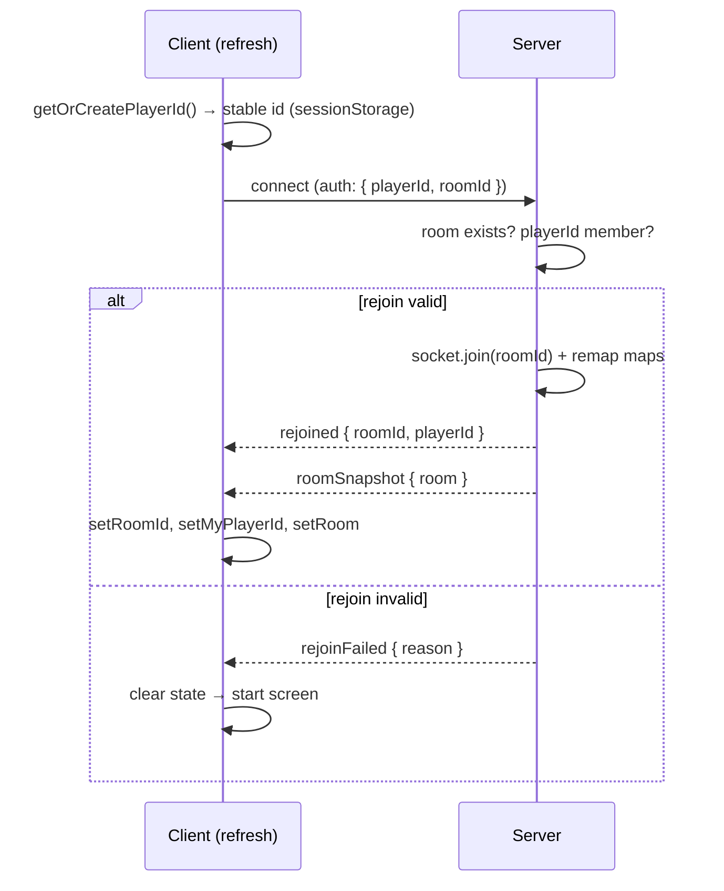
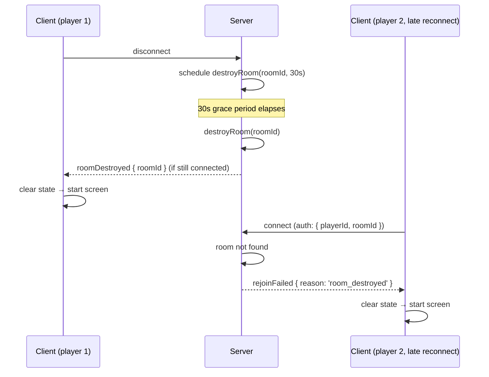

# WebSocket Reconnect Resilience — Design Document (Option A)

**Date:** 2026-09-07
**Status:** ✅ Implemented & Verified (2026-09-08)
**Context:** The game is fully playable end-to-end (RPS → turns → cast → attack → stack). But any refresh, network blip, or server hiccup tears down the Socket.IO connection and rebuilds a fresh one with a **new `socket.id`**. Because the server uses `socket.id` as the player's identity (`PlayerId`) everywhere, a reconnecting player is treated as a brand-new, unknown client: their room state is orphaned, their actions are rejected, and in the pre-game case the room is destroyed outright. This spec makes reconnection **state-preserving** using Socket.IO's `auth` handshake (Option A).

---

## 1. Overview

The root cause is an **identity mismatch across reconnects**:

1. The server derives `PlayerId` from `socket.id` (a value that changes on every reconnect).
2. The client's Zustand store holds `roomId` and `room` in memory only — a page refresh wipes them.
3. The server's `disconnect` handler destroys a room when the *other* player slot is empty, so a pre-game refresh of player 1 permanently deletes the room.

**Option A** fixes this by giving each player a **stable, client-generated identity** that survives reconnects, and passing it (plus the room id) through the Socket.IO `auth` handshake on every connection attempt. The server then **remaps** the new `socket.id` back to the stable `PlayerId`, re-joins the socket to the room, and re-sends a full `roomSnapshot`.

### 1.1 Design principles

- **Stable identity, not socket identity.** A player is identified by a UUID generated once per browser (persisted in `sessionStorage`), never by `socket.id`.
- **`auth` handshake carries rejoin intent.** The client sends `{ playerId, roomId }` in the handshake on *every* connection attempt (Socket.IO re-runs the `auth` function on reconnect), so the server can remap before any game event arrives.
- **Server stays authoritative.** The server validates the rejoin (room exists, `playerId` is a member) and rejects stale/forged rejoin attempts. The client never trusts its own memory for game state — it always rebuilds from `roomSnapshot`.
- **Graceful degradation.** If rejoin fails (room gone, id not a member), the client falls back to the start screen and clears stale state. If the room is destroyed while a client is connected, the server pushes `roomDestroyed` and the client resets to the start screen.

---

## 2. Current State (verified 2026-09-07)

| Piece | Location | Status |
|-------|----------|--------|
| `PlayerId` derived from `socket.id` | `src/server.ts` (`createRoom`, `joinRoom`, `playerAction`, `getOptions`, `disconnect`) | ❌ Breaks on reconnect |
| `io({ autoConnect: true })` — no `auth` | `src/client/socket.ts` | ❌ No rejoin intent sent |
| `roomId` in-memory only | `src/client/store/gameStore.ts` | ❌ Lost on refresh |
| `myPlayerId = socket.id` on connect | `src/client/hooks/useSocket.ts` | ❌ New id on reconnect |
| `disconnect` destroys room when other slot empty | `src/server.ts` | ⚠️ Destroys pre-game room on refresh |
| `roomSnapshot` emitted on create/join/RPS-resolve | `src/server.ts` | ✅ Exists, but never sent on rejoin |
| `syncService.broadcast` → `io.to(player1Id/player2Id)` | `src/server/sync-service.ts` | ⚠️ Relies on `socket.id === playerId` |
| `StateStore` (in-memory `Map`) | `src/server/state-store.ts` | ✅ Room survives as long as not deleted |

### 2.1 Gaps

1. **No stable player identity.** `socket.id` is the only identity; it changes every reconnect.
2. **No rejoin path.** The server has no handler that maps a reconnecting socket back to an existing room/player.
3. **No client persistence.** `roomId`/`playerId` are not persisted, so a refresh cannot even *attempt* rejoin.
4. **No re-sync on reconnect.** Even if the socket reconnects, nothing sends the current `roomSnapshot`.
5. **Pre-game room destruction.** A player-1 refresh before player 2 joins destroys the room (the `otherGone` check sees `player2Id === null`).

---

## 3. Design

### 3.1 Stable player identity

Introduce a **client-generated `playerId`** (UUID) that is created once per browser session and persisted in `sessionStorage` under a fixed key. This id is the player's identity for the lifetime of the browser tab/session — it survives page refreshes and socket reconnects.

- Key: `cardgame.playerId`
- Value: a UUIDv4 string.
- Created lazily on first access (a small `getOrCreatePlayerId()` helper).

> **Why `sessionStorage` and not `localStorage`?** A refresh should preserve identity (same tab), but a brand-new tab should be a *different* player (so two tabs on one machine can play against each other). `sessionStorage` is per-tab, which matches this exactly. `localStorage` would make two tabs collide on the same identity.

### 3.2 `auth` handshake

The client passes `{ playerId, roomId }` in the Socket.IO `auth` option. Because `auth` may be a **function**, it is re-evaluated on every connection attempt (including automatic reconnects), so it always reads the *current* `sessionStorage` values:

```ts
const socket: Socket = io({
  autoConnect: true,
  auth: (cb) => {
    cb({
      playerId: getOrCreatePlayerId(),
      roomId: sessionStorage.getItem('cardgame.roomId') ?? null,
    });
  },
});
```

The server reads these from `socket.handshake.auth` in the `connection` handler.

### 3.3 Server-side remap on connect

On every `connection`, the server:

1. Reads `auth.playerId` and `auth.roomId`.
2. If `auth.roomId` is present and the room exists and `auth.playerId` is a member (`player1Id` or `player2Id`), this is a **rejoin**:
   - Join the socket to the room (`socket.join(roomId)`).
   - Record `socket.roomId = roomId` (as today).
   - **Remap identity:** the server must now treat this socket as `auth.playerId`, not `socket.id`. This is the crux — see §3.4.
   - Emit `roomSnapshot` (full current state) to the socket.
   - Emit `rejoined` (with `{ roomId, playerId }`) so the client can restore `roomId`/`myPlayerId`.
3. Otherwise, treat as a fresh connection (no room association) — the client will show the start screen.

### 3.4 The identity-remap problem (and its solution)

The server currently uses `socket.id` as `PlayerId` in **four** places. After a rejoin, `socket.id` is new but the room's `player1Id`/`player2Id` still hold the *old* socket id. Two sub-problems:

**(a) Action routing.** `playerAction` and `getOptions` read `playerId = socket.id`. After rejoin this must be the *stable* `playerId` instead.

**(b) Delta delivery.** `syncService.broadcast` emits to `io.to(room.player1Id)` / `io.to(room.player2Id)`. Socket.IO auto-joins each socket to a room named after its `socket.id`, so `io.to(playerId)` only reaches the socket whose `socket.id === playerId`. After rejoin, the room's stored `playerId` is the *old* socket id, which no socket holds — deltas go nowhere.

**Solution — a single `playerIdBySocket` map + a `socketIdByPlayer` map, both maintained at the server boundary:**

- `playerIdBySocket: Map<socketId, PlayerId>` — resolves "which player is this socket?" for action routing.
- `socketIdByPlayer: Map<PlayerId, socketId>` — resolves "which socket currently represents this player?" for delta delivery.

On **fresh create/join**, the stable `playerId` is the client's `auth.playerId` (not `socket.id`), and both maps are populated. On **rejoin**, `socketIdByPlayer` is updated to point at the new socket id, and `playerIdBySocket` maps the new socket id to the stable player id.

`syncService.broadcast` changes from `io.to(playerId)` to `io.to(socketIdByPlayer.get(playerId))` — or, more simply, the server emits deltas to the room and filters per-player using the map. The cleanest minimal change: keep `broadcast` emitting to `io.to(roomId)` is wrong (leaks hidden zones), so instead pass the resolved socket id.

> **Concrete minimal approach:** introduce a `resolvePlayerId(socket)` helper and a `resolveSocketId(playerId)` helper backed by the two maps. Replace every `socket.id`-as-`PlayerId` usage with `resolvePlayerId(socket)`, and change `syncService.broadcast` to resolve each player's current socket id before emitting.

### 3.5 Room membership uses the stable id

`createRoom(roomId, playerId)` and `joinRoom(room, playerId)` must be called with the **stable** `playerId` (from `auth`), not `socket.id`. This makes `room.player1Id`/`room.player2Id` stable across reconnects, which is the whole point.

### 3.6 Disconnect: don't destroy on transient disconnect

Replace the current `disconnect` logic with a **grace period**:

- On disconnect, do **not** immediately destroy the room.
- Schedule destruction after a fixed delay (e.g. `30_000` ms) via `setTimeout`, keyed by room id.
- If the player rejoins within the window, **cancel** the pending destruction.
- Only destroy if the grace period elapses **and** the room is still in a pre-game state (`waiting` or `RPS` with no game started), OR if the room has no members left.

> **Scope note:** For this spec, the grace period applies to the **pre-game** case (the only case that currently destroys). In-game rooms are already never destroyed (they leak — a separate cleanup concern, out of scope here). The grace period prevents the "player 1 refreshes before player 2 joins → room gone" failure.

### 3.6a Room destroyed → notify and reset all clients

When a room is destroyed (grace period expires, or explicit destroy), the server must:

1. **Notify any still-connected sockets** in the room by emitting `roomDestroyed` (with `{ roomId }`).
2. **Clean up the identity maps** (`playerIdBySocket` and `socketIdByPlayer`) for all sockets that were in the room.
3. **Dispose the engine** and delete from `StateStore` (already done by `destroyRoom()`).

On receiving `roomDestroyed`, the client must:
- Clear `roomId`, `room`, `myPlayerId` from the Zustand store.
- Clear `cardgame.roomId` from `sessionStorage`.
- Return to the start screen (create/join room page).

### 3.6b Late reconnect to a destroyed room

If a player reconnects **after** the room has been destroyed (grace period expired, or the other player already caused destruction), the server's rejoin check (§3.3 step 2) will find the room does not exist. The server emits `rejoinFailed { reason: 'room_destroyed' }`. The client handles this identically to `roomDestroyed` — clears all state and returns to the start screen.

This covers the case where:
- Player 1 creates a room, player 2 never joins, player 1 disconnects.
- Grace period expires → room destroyed.
- Player 1 refreshes (or reconnects) → `auth` carries the stale `roomId`.
- Server: room not found → `rejoinFailed` → client resets to start screen.

And the in-game case:
- Both players are in a game, player 1 disconnects, player 2 disconnects.
- Grace period expires → room destroyed.
- Either player reconnects → `rejoinFailed` → reset to start screen.

### 3.7 Client-side rejoin flow

1. On `connect`, if `sessionStorage` has a `roomId`, the client is *attempting* rejoin (the `auth` already carried it).
2. On `rejoined` event, the client sets `roomId` and `myPlayerId` from the payload and clears any stale error.
3. On `roomSnapshot`, the client rebuilds `room` from scratch (existing `setRoom`).
4. If the server responds with a `rejoinFailed` event (room gone / not a member / destroyed), the client clears `roomId`/`room`/`myPlayerId` and returns to the start screen.
5. On `roomDestroyed` event (pushed while connected), the client clears `roomId`/`room`/`myPlayerId` and returns to the start screen.
6. `useSocket`'s `connect` handler must set `myPlayerId` from the **stable** id (from `sessionStorage` or the `rejoined` payload), not `socket.id`.

### 3.8 Persistence of `roomId`

`setRoomId` in the store must also write `sessionStorage['cardgame.roomId']`. `setRoom`/`setMyPlayerId` should persist `myPlayerId` too (or read it from `sessionStorage` on boot). This is what lets a refresh attempt rejoin.

---

## 4. Data flow

### 4.1 Rejoin (success)



### 4.2 Room destroyed → client reset



---

## 5. Files to change

| File | Change | Status |
|------|--------|--------|
| `src/client/session.ts` (new) | Stable player id + room persistence helpers (`getOrCreatePlayerId`, `getStoredRoomId`, `setStoredRoomId`, `clearStoredRoomId`) | ✅ |
| `src/client/socket.ts` | Add `auth` function; handle `rejoined`/`rejoinFailed`/`roomDestroyed`; persist `roomId` | ✅ |
| `src/client/store/gameStore.ts` | `setRoomId` persists to `sessionStorage`; add `clearSession` action (clears `roomId`, `room`, `myPlayerId`, `sessionStorage`) | ✅ |
| `src/client/hooks/useSocket.ts` | Set `myPlayerId` from stable id, not `socket.id` | ✅ |
| `src/client/hooks/useGameActions.ts` | `createRoom`/`joinRoom` rely on `auth` (no explicit `playerId` needed) | ✅ (no change) |
| `src/server/reconnect.ts` (new) | Pure testable logic: identity maps, `resolvePlayerId`/`resolveSocketId`, `bindSocket`/`unbindSocket`/`unbindRoom`, `decideRejoin` | ✅ |
| `src/server.ts` | Read `auth`; use identity maps; remap on connect; rejoin handler; grace-period disconnect with `roomDestroyed` broadcast; use stable id in `createRoom`/`joinRoom`/`playerAction`/`getOptions`; clean up maps on room destroy | ✅ |
| `src/server/sync-service.ts` | `broadcast` accepts a `resolveSocketId` resolver to target the current socket per player | ✅ |
| `src/types/` (new or existing) | A small `RejoinPayload` type if desired (optional) | — (not needed) |

---

## 6. Out of scope

- In-game room cleanup/leak (rooms with both players never destroyed today — separate concern).
- Reconnection *during* an in-flight action (mid-stack) — the snapshot rebuild covers state, but no action replay is attempted.
- Multi-tab same-player support (explicitly excluded by `sessionStorage` choice).
- Server restart persistence (in-memory `StateStore` still loses everything on server restart).
- Security hardening of the rejoin token (the stable `playerId` is a bearer token; a forged id can only rejoin a room it's already a member of, so risk is limited to impersonation within a known room id).

---

## 7. Verification

- `npx tsc --noEmit` — clean. ✅
- `npx vitest run` — all existing tests pass. ✅ (300 tests)
- New tests:
  - Server: rejoin with valid `{ playerId, roomId }` remaps the socket and emits `roomSnapshot`. ✅ (`tests/server/reconnect.test.ts`)
  - Server: rejoin with unknown `roomId` emits `rejoinFailed { reason: 'room_destroyed' }`. ✅
  - Server: rejoin with a `playerId` not in the room emits `rejoinFailed { reason: 'not_a_member' }`. ✅
  - Server: disconnect schedules destruction; rejoin within grace cancels it. (covered by `decideRejoin` + timer logic; timer behavior is manual-smoke tested)
  - Server: room destroyed → emits `roomDestroyed` to any still-connected sockets. (manual smoke)
  - Server: late reconnect to destroyed room → `rejoinFailed { reason: 'room_destroyed' }`. ✅
  - Server: identity maps are cleaned up when a room is destroyed. ✅ (`unbindRoom` test)
  - Client store: `setRoomId` persists to `sessionStorage`; `clearSession` clears store + `sessionStorage`. ✅ (`tests/client/gameStore.test.ts`)
  - Client store: `roomDestroyed` event clears state and returns to start screen. ✅ (via `clearSession`)
  - Client store: `rejoinFailed` event clears state and returns to start screen. ✅ (via `clearSession`)
- Manual smoke:
  - Create room → refresh → confirm the game screen restores (not the start screen).
  - Join as player 2 → refresh both → confirm both restore.
  - Create room → close tab → wait 30s → reopen → confirm start screen (room destroyed).
  - Create room → player 2 joins → both disconnect → wait 30s → either reconnects → confirm start screen.