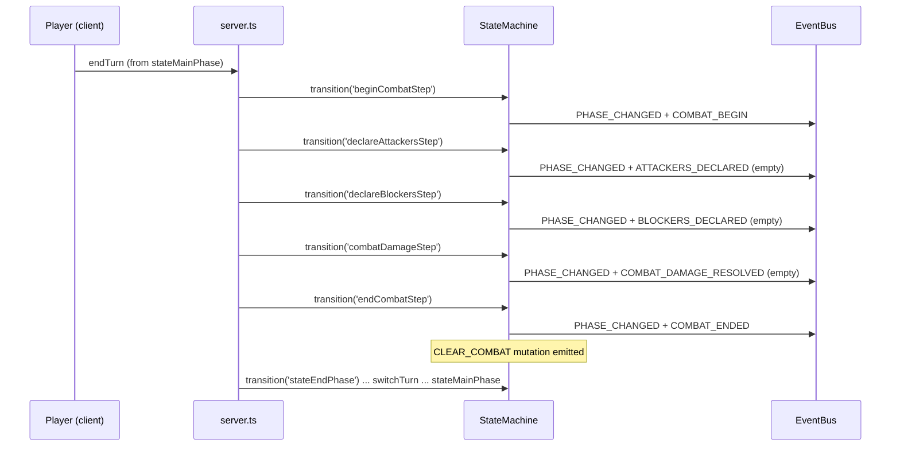

# MTG Combat Phase Pipeline — Design Document

**Date:** 2026-09-08
**Status:** 📝 DESIGN (not yet implemented)
**Scope:** This spec covers the **combat phase pipeline and timing only** — the five MTG combat steps as flat phase states, their auto-advance transitions, and stub event emissions for testing. It does **not** implement combat mechanics (batch declare attackers, declare blockers, combat damage assignment). Those are deferred to a follow-up spec. See §6 (Out of scope).
**Context:** The stack-model spec (`2026-09-06-full-mtg-stack-model-design.md`) separated the four MTG concepts (cast, activate, trigger, declare attackers) into distinct data shapes, but explicitly left the combat phase Hearthstone-style: per-attack tap-to-target, no declare-blockers step, damage resolves immediately. This spec builds the MTG-faithful combat **phase structure** (the five steps) as a timing skeleton, so the follow-up mechanics spec has a place to hang real combat rules.

---

## 1. Overview

MTG combat (CR 506–511) is a sequence of five steps:

| Step | CR | What happens (real MTG) | What happens (this spec) |
|------|----|--------------------------|--------------------------|
| **Beginning of Combat** | 507 | "At beginning of combat" triggers fire | No-op — emit `COMBAT_BEGIN` |
| **Declare Attackers** | 508 | Active player declares attackers as a batch | No-op — emit `ATTACKERS_DECLARED` with empty attackers |
| **Declare Blockers** | 509 | Defending player assigns blockers | No-op — emit `BLOCKERS_DECLARED` with empty blockers |
| **Combat Damage** | 510 | Damage is assigned and dealt | No-op — emit `COMBAT_DAMAGE_RESOLVED` with empty assignments |
| **End of Combat** | 511 | "At end of combat" triggers fire | Clear combat declarations — emit `COMBAT_ENDED` |

The current codebase models combat as a single `stateBattlePhase` with an `endCombat` phase, and attacks resolve immediately (Hearthstone-style). This spec replaces those two phases with the five flat steps above, wired as an **auto-advancing pipeline**: entering combat walks through all five steps in sequence with no priority windows and no player input between steps.

The goal is **pipeline and timing only**. The steps are pure timing markers that emit events. The existing per-creature attack handler is preserved, but its `validate()` phase check moves from `stateBattlePhase` to `stateMainPhase` (pre-combat), since `stateBattlePhase` no longer exists. The follow-up spec will move attacks into `declareAttackersStep` as a batch action.

---

## 2. Current State (verified 2026-09-08)

| Piece | Location | Status |
|-------|----------|--------|
| `GameStateName` includes `stateBattlePhase`, `endCombat` | `src/types/game.state.types.ts` | ⚠️ To be replaced by 5 steps |
| `TRANSITIONS` map | `src/engine/state-machine.ts` | ⚠️ Flat phase transitions |
| `transition()` emits `PHASE_CHANGED` | `src/engine/state-machine.ts` | ✅ Reused for each step |
| `CLEAR_COMBAT` on entering `endCombat` | `src/engine/state-machine.ts` | ⚠️ Moves to `endCombatStep` |
| `endTurn` handler (no propose/resolve) | `src/engine/handlers/end-turn-handler.ts` | ✅ Unchanged |
| `server.ts` endTurn branch | `src/server.ts` | ⚠️ Rewires combat chain |
| `PhaseBar.tsx` button + labels | `src/client/components/PhaseBar.tsx` | ⚠️ Adds 5 labels |
| `attackHandler` (per-creature, immediate damage) | `src/engine/handlers/attack-handler.ts` | ⚠️ `validate()` requires `stateBattlePhase` — must change to `stateMainPhase` |
| `option-service.ts` "Attack" option gate | `src/engine/option-service.ts` | ⚠️ `canAttack` requires `stateBattlePhase` — must change to `stateMainPhase` |
| `CombatDeclaration` type | `src/types/effect.types.ts` | ✅ Unchanged |
| `room.combat: CombatDeclaration[]` | `src/types/game.room.types.ts` | ✅ Unchanged |

### Gaps

1. **No combat step structure.** Combat is a single `stateBattlePhase`; there is no place to hang "at beginning of combat" triggers, declare-blockers logic, or combat-damage assignment.
2. **`endCombat` is a phase, not a step.** MTG's end-of-combat is a step within the combat phase, not a separate phase. The current model treats it as a sibling of `stateBattlePhase`.
3. **No combat-specific events.** Only `PHASE_CHANGED` and `ATTACK_DECLARED` exist. There are no events for the other four steps, so tests cannot assert the full pipeline ran.

---

## 3. Design

### 3.1 Phase states

Replace `stateBattlePhase` and `endCombat` with five flat `GameStateName` values:

```ts
export type GameStateName =
    | 'waiting'
    | 'RPS'
    | 'stateTurnStart'
    | 'stateDrawPhase'
    | 'stateMainPhase'
    | 'beginCombatStep'
    | 'declareAttackersStep'
    | 'declareBlockersStep'
    | 'combatDamageStep'
    | 'endCombatStep'
    | 'stateEndPhase'
    | 'cleanupStep'
    | 'Stack'
    | 'gameOver';
```

The five steps are **flat** (each is a top-level `GameStateName`), matching the existing flat phase model. No nested "combat phase" container is introduced — the `Stack` phase already demonstrates the flat approach, and nesting would require a new state-shape concept for no benefit at this stage.

### 3.2 Transition map

```ts
const TRANSITIONS: GameTransitionMap = {
  waiting: ['RPS'],
  RPS: ['stateTurnStart', 'RPS', 'Stack'],
  stateTurnStart: ['stateDrawPhase', 'Stack'],
  stateDrawPhase: ['stateMainPhase', 'Stack'],
  stateMainPhase: ['beginCombatStep', 'stateEndPhase', 'Stack'],
  beginCombatStep: ['declareAttackersStep', 'Stack'],
  declareAttackersStep: ['declareBlockersStep', 'Stack'],
  declareBlockersStep: ['combatDamageStep', 'Stack'],
  combatDamageStep: ['endCombatStep', 'Stack'],
  endCombatStep: ['stateEndPhase', 'Stack'],
  stateEndPhase: ['cleanupStep', 'Stack'],
  cleanupStep: ['stateTurnStart'],
  Stack: [],
  gameOver: [],
};
```

Each step still allows `Stack` as a destination (a player could cast an instant mid-combat in the future), preserving the existing `canTransition` behavior for stack openings.

### 3.3 Auto-advance pipeline

Entering combat is a **single turn-based action** that walks through all five steps. The `server.ts` endTurn branch changes from:

```ts
if (room.currentPhase === 'stateMainPhase') {
  allMutations.push(...engine.transition('stateBattlePhase'));
  allMutations.push(...engine.givePriorityTo(engine.activeTurnPlayerId));
}
```

to:

```ts
if (room.currentPhase === 'stateMainPhase') {
  allMutations.push(...engine.transition('beginCombatStep'));
  allMutations.push(...engine.transition('declareAttackersStep'));
  allMutations.push(...engine.transition('declareBlockersStep'));
  allMutations.push(...engine.transition('combatDamageStep'));
  allMutations.push(...engine.transition('endCombatStep'));
  allMutations.push(...engine.transition('stateEndPhase'));
  allMutations.push(...engine.transition('cleanupStep'));
  allMutations.push(...engine.transition('stateTurnStart'));
  allMutations.push(...engine.switchTurn());
  allMutations.push(...engine.transition('stateDrawPhase'));
  allMutations.push(...engine.transition('stateMainPhase'));
  allMutations.push(...engine.givePriorityTo(engine.activeTurnPlayerId));
}
```

This collapses the previous two-branch structure (main-phase → battle, battle → end-of-turn) into a single linear chain: entering combat now runs the full combat pipeline **and** completes the turn in one action. The `else` branch (battle phase → end turn) is removed because there is no longer a "battle phase" to be in — the player is either in `stateMainPhase` (pre-combat) or the turn has already advanced past combat.

> **Note on priority:** the current model gives priority only at the start of `stateMainPhase`. The combat steps do **not** give priority (no priority windows in combat yet). This matches the existing "no priority in combat" behavior and keeps the pipeline a pure auto-advance. Priority windows inside combat are deferred to the follow-up mechanics spec.

### 3.4 Stub events

Each step emits `PHASE_CHANGED` (already built into `transition()`) **plus** one dedicated combat event. The dedicated events are emitted from `transition()` when the target phase is a combat step, alongside the existing `PHASE_CHANGED` emission.

| Step | Dedicated event | Payload |
|------|-----------------|---------|
| `beginCombatStep` | `COMBAT_BEGIN` | `{ currentPlayer }` |
| `declareAttackersStep` | `ATTACKERS_DECLARED` | `{ attackerIds: [] }` |
| `declareBlockersStep` | `BLOCKERS_DECLARED` | `{ blockerAssignments: [] }` |
| `combatDamageStep` | `COMBAT_DAMAGE_RESOLVED` | `{ damageAssignments: [] }` |
| `endCombatStep` | `COMBAT_ENDED` | `{ currentPlayer }` |

The empty-array payloads are intentional stubs: they give the follow-up spec a stable event shape to fill in, and give tests a concrete value to assert against. `ATTACKERS_DECLARED` is distinct from the existing `ATTACK_DECLARED` (which fires per-attack in `game-engine.ts` and remains unchanged).

### 3.5 `CLEAR_COMBAT` relocation

The `CLEAR_COMBAT` mutation currently fires on entering `endCombat`. It moves to `endCombatStep`:

```ts
if (to === 'endCombatStep') {
  mutations.push({ type: 'CLEAR_COMBAT' });
}
```

This keeps the invariant "combat declarations are cleared at the end of combat" while aligning the mutation with the correct step name.

### 3.6 Attack handler phase check

The attack handler's `validate()` currently requires `stateBattlePhase`:

```ts
if (room.currentPhase !== 'stateBattlePhase') {
  return { success: false, phase: 'validate', reason: 'Can only attack during battle phase' };
}
```

Since `stateBattlePhase` is removed, this check changes to `stateMainPhase`:

```ts
if (room.currentPhase !== 'stateMainPhase') {
  return { success: false, phase: 'validate', reason: 'Can only attack during main phase' };
}
```

This preserves current gameplay (players can still attack pre-combat) while the combat steps remain no-op placeholders. The follow-up spec relocates attacks into `declareAttackersStep` as a batch action and removes this pre-combat path.

The same phase gate exists in `option-service.ts`, which controls whether the "Attack" context-menu option is enabled:

```ts
const canAttack = !card.state.isTapped && !card.state.summoningSickness
  && !card.state.attackedThisTurn
  && room.activeTurnPlayerId === playerId
  && room.currentPhase === 'stateBattlePhase';
```

Both the `canAttack` flag and the `disabledReason` string (`'Not in battle phase'`) change to reference `stateMainPhase` (`'Not in main phase'`), keeping the client option in sync with the server-side `validate()`.

### 3.7 Client changes

`PhaseBar.tsx`:

1. Add five entries to `PHASE_LABELS`:
   ```ts
   beginCombatStep: 'Beginning of Combat',
   declareAttackersStep: 'Declare Attackers',
   declareBlockersStep: 'Declare Blockers',
   combatDamageStep: 'Combat Damage',
   endCombatStep: 'End of Combat',
   ```
2. The button label logic stays `phase === 'stateMainPhase' ? 'Enter Battle' : 'End Turn'`. Since the combat steps auto-advance instantly, the player will never actually see the intermediate step labels in normal play — they exist for debugging and for the follow-up spec when steps become interactive.

No other client changes are required. The right-click → Attack targeting flow is unchanged; it now works in `stateMainPhase` (pre-combat) instead of `stateBattlePhase`, matching the server-side `validate()` change in §3.6.

---

## 4. Data flow



---

## 5. Testing

A new smoke test (`tests/engine/combat-pipeline-smoke.test.ts`) asserts:

1. **Phase sequence** — entering combat from `stateMainPhase` produces `SET_PHASE` mutations in the exact order `beginCombatStep → declareAttackersStep → declareBlockersStep → combatDamageStep → endCombatStep → stateEndPhase → cleanupStep → stateTurnStart → stateDrawPhase → stateMainPhase`.
2. **Event sequence** — the five dedicated events fire in order: `COMBAT_BEGIN`, `ATTACKERS_DECLARED`, `BLOCKERS_DECLARED`, `COMBAT_DAMAGE_RESOLVED`, `COMBAT_ENDED`.
3. **Empty payloads** — `ATTACKERS_DECLARED`, `BLOCKERS_DECLARED`, and `COMBAT_DAMAGE_RESOLVED` carry empty arrays.
4. **`CLEAR_COMBAT`** — fires on entering `endCombatStep`, not before.
5. **Existing attack still works** — the per-creature attack handler is valid in `stateMainPhase` and rejected in the combat steps (regression guard for the §3.6 phase-check change).

Existing tests that reference `stateBattlePhase` or `endCombat` must be updated to the new step names.

---

## 6. Out of scope (follow-up spec)

The following are explicitly deferred to a **combat mechanics** spec:

- **Batch declare attackers** — selecting multiple creatures, tapping them, validating legal attackers (summoning sickness, tapped, etc.).
- **Declare blockers** — assigning blockers to attackers, validating legal blocks (flying evasion, etc.).
- **Combat damage assignment** — power/toughness, trample, multiple blockers, first strike.
- **`CombatDeclaration` type changes** — adding a `blockers` field and batch semantics.
- **Priority windows inside combat** — giving players priority between steps (MTG 508.1, 509.1, 510.1).
- **"At beginning/end of combat" triggers** — wiring `COMBAT_BEGIN` / `COMBAT_ENDED` into the trigger system.
- **Moving attacks out of `stateMainPhase`** — attacks currently happen pre-combat; the follow-up spec relocates them into `declareAttackersStep`.

---

## 7. Risks and mitigations

| Risk | Mitigation |
|------|------------|
| The auto-advance pipeline makes combat steps invisible to players | Acceptable — this is a timing skeleton; steps become visible/interactive in the follow-up spec |
| Collapsing the two-branch endTurn into one chain changes turn flow | The chain is a strict superset of the old flow; regression tests cover the full sequence |
| `ATTACKERS_DECLARED` vs `ATTACK_DECLARED` naming confusion | Documented in §3.4; the former is a step event, the latter is a per-attack event |
| Existing tests break on phase renames | §5 lists the rename; tests are updated in the same change |