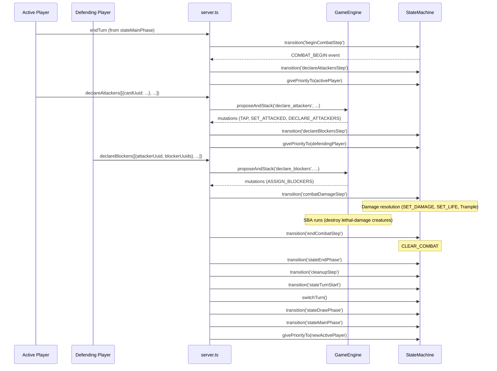

# MTG Combat Mechanics — Design Document

**Date:** 2026-09-10
**Status:** 📝 DESIGN (not yet implemented)
**Scope:** This spec covers the **MTG-faithful combat mechanics** — batch declare attackers, declare blockers, and deferred combat damage resolution — filling in the 5-step combat pipeline skeleton built in `2026-09-08-mtg-combat-pipeline-design.md`. It replaces the Hearthstone-style per-creature attack model (attack a creature or player, immediate damage) with the MTG model (attackers always target the defending player, blockers intercept, damage resolved simultaneously in `combatDamageStep`).
**Context:** The combat pipeline spec (`2026-09-08`) built the 5-step timing skeleton (beginCombatStep → declareAttackersStep → declareBlockersStep → combatDamageStep → endCombatStep) with stub events and auto-advance. This spec makes those steps **interactive** and fills in the real combat rules.

---

## 1. Overview

### 1.1 The MTG combat model (CR 506–510)

In MTG, combat is a sequence of five steps. The key semantic difference from the current Hearthstone-style model:

| Concept | Hearthstone-style (current) | MTG-style (this spec) |
|---------|---------------------------|----------------------|
| Attacker's target | Player **or** creature | Always the defending player |
| Blockers | None | Defending player assigns creatures to intercept attackers |
| Unblocked attacker | N/A | Deals damage to defending player |
| Blocked attacker | N/A | Deals damage to its blocker; blocker deals counter-damage |
| Damage timing | Immediate (per-attack) | Deferred to `combatDamageStep` (simultaneous) |
| Flying | "Can't attack a flyer" | "Can't be blocked by non-flyers" |
| Trample | "Excess over defender toughness" | "Excess over total blocker toughness" |

### 1.2 The three-step interactive flow

```
stateMainPhase
  │  [End Turn]
  ▼
beginCombatStep          ← "at beginning of combat" triggers (stub)
  │  [auto-advance]
  ▼
declareAttackersStep     ← ACTIVE PLAYER sends declareAttackers (batch)
  │  [confirm → auto-advance to declareBlockersStep]
  ▼
declareBlockersStep      ← DEFENDING PLAYER sends declareBlockers
  │  [confirm → auto-advance through combatDamageStep → endCombatStep → turn completion]
  ▼
combatDamageStep         ← engine resolves all damage simultaneously
  │  [auto-advance]
  ▼
endCombatStep            ← "at end of combat" triggers, CLEAR_COMBAT
  │  [auto-advance]
  ▼
stateEndPhase → cleanupStep → turnStart → switchTurn → drawPhase → mainPhase
```

No priority windows inside combat (deferred). Steps advance via explicit confirm actions from the appropriate player.

---

## 2. Current State (verified 2026-09-10)

| Piece | Location | Status |
|-------|----------|--------|
| 5-step combat pipeline | `src/types/game.state.types.ts`, `src/engine/state-machine.ts` | ✅ Built (stub events, auto-advance) |
| `attackHandler` (per-creature, immediate damage) | `src/engine/handlers/attack-handler.ts` | ⚠️ To be deleted |
| `CombatDeclaration` (target: player or creature) | `src/types/effect.types.ts` | ⚠️ To be simplified |
| `room.combat: CombatDeclaration[]` | `src/types/game.room.types.ts` | ✅ Reused |
| SBA (creature death from lethal damage) | `src/engine/state-based-actions.ts` | ✅ Built |
| `ON_DIE` / `ON_DAMAGE_TAKEN` triggers | `src/engine/trigger-manager.ts` | ✅ Built |
| `attackedThisTurn` flag | `src/types/card.types.ts` | ✅ Built |
| `SET_DAMAGE` / `SET_LIFE` primitives | `src/types/game-mutation.types.ts`, `src/engine/game-reducer.ts` | ✅ Built |
| `ADD_COMBAT_DECLARATION` mutation | `src/types/game-mutation.types.ts` | ⚠️ To be replaced by `DECLARE_ATTACKERS` |
| `CLEAR_COMBAT` mutation | `src/types/game-mutation.types.ts` | ✅ Unchanged |
| `server.ts` endTurn chain (all 5 steps + turn) | `src/server.ts` | ⚠️ To be split into 3 actions |
| `PhaseBar.tsx` "Enter Battle" button | `src/client/components/PhaseBar.tsx` | ⚠️ To become contextual |
| `CombatDisplay.tsx` | `src/client/components/CombatDisplay.tsx` | ⚠️ To show blocker assignments |
| `option-service.ts` attack option | `src/engine/option-service.ts` | ⚠️ To be removed |
| `ACTION_IDS.attack` | `src/types/action.ids.ts` | ⚠️ To be removed |

### Gaps

1. **Attackers target creatures.** The current `attackHandler` lets a creature attack either the opponent player or an opponent creature. In MTG, attackers always target the defending player; blockers intercept.
2. **No blocker step.** `declareBlockersStep` is a no-op stub. The defending player has no way to assign blockers.
3. **Damage is immediate.** Damage is applied in `attackHandler.propose()`, not deferred to `combatDamageStep`.
4. **Flying is an attack restriction.** Currently "can't attack a flying creature." In MTG, flying is a blocking restriction: "can't be blocked except by creatures with flying."
5. **Single-attacker model.** Attacks happen one at a time in `stateMainPhase`. MTG declares all attackers as a batch in `declareAttackersStep`.

---

## 3. Design

### 3.1 `CombatDeclaration` — simplified

```ts
// BEFORE (Hearthstone-style)
export interface CombatDeclaration {
  readonly uuid: string;
  readonly attacker: CardInstance;
  readonly target: TargetPointer;       // player OR creature
  readonly attackerPower: number;
  readonly defenderPower?: number;      // creature target only
}

// AFTER (MTG-style)
export interface CombatDeclaration {
  readonly uuid: string;
  readonly attacker: CardInstance;      // the attacking creature
  readonly attackerPower: number;       // locked at declaration time
  readonly blockers: CardInstance[];    // filled during declareBlockersStep (empty = unblocked)
  // target is always the defending player (implicit — not stored)
}
```

`target` and `defenderPower` are removed. `blockers` starts empty, gets populated by `declareBlockersHandler`.

### 3.2 New action IDs

Two new entries in `ACTION_IDS`:

```ts
declareAttackers: 'declare_attackers',
declareBlockers: 'declare_blockers',
```

`attack` is **removed** from `ACTION_IDS` (the old per-creature attack handler is deleted).

### 3.3 New mutations

```ts
// Batch declare attackers — replaces ADD_COMBAT_DECLARATION (singular)
{ type: 'DECLARE_ATTACKERS'; declarations: CombatDeclaration[] }

// Assign blockers to an attacker
{ type: 'ASSIGN_BLOCKERS'; attackerUuid: string; blockerUuids: string[] }
```

`ADD_COMBAT_DECLARATION` is removed. `CLEAR_COMBAT` stays (fires at `endCombatStep`).

### 3.4 `declareAttackersHandler` — batch declare attackers

**validate:**
- Must be the active player's turn
- Must be in `declareAttackersStep`
- `action.attackers: { cardUuid: string }[]` — at least one attacker required
- Each attacker: on battlefield, controlled by the player, is a Creature, untapped, no summoning sickness, `attackedThisTurn === false`
- No duplicate cardUuids

**propose:**
- For each attacker: `TAP_CARD` + `SET_ATTACKED_THIS_TURN`
- Build `CombatDeclaration[]` with empty `blockers: []`
- `DECLARE_ATTACKERS` mutation (pushes all declarations to `room.combat` at once)
- Emit `ATTACKERS_DECLARED` with actual attacker IDs (no longer a stub empty array)
- No `stackObject` — turn-based action, damage applied later in `combatDamageStep`

### 3.5 `declareBlockersHandler` — assign blockers

**validate:**
- Must be the defending player (NOT the active player)
- Must be in `declareBlockersStep`
- `action.assignments: { attackerUuid: string, blockerUuids: string[] }[]`
- Each `attackerUuid` must exist in `room.combat`
- Each blocker: on battlefield, controlled by the defending player, is a Creature, untapped
- A blocker can only block one attacker (no duplicate blockerUuids across assignments)
- Flying evasion: a non-flying creature cannot block a flying attacker
- Blocking does not tap the blocker (MTG CR 509.1f — blockers are not tapped)

**propose:**
- For each assignment: push blocker `CardInstance` references into the corresponding `CombatDeclaration.blockers`
- `ASSIGN_BLOCKERS` mutation
- Emit `BLOCKERS_DECLARED` with actual assignments (no longer a stub empty array)
- No `stackObject` — turn-based action

### 3.6 `combatDamageStep` — damage resolution

Moves from a no-op stub to actual damage logic in `state-machine.ts`. Runs when transitioning **to** `combatDamageStep`:

```ts
if (to === 'combatDamageStep') {
  const defendingPlayerId = room.activeTurnPlayerId === room.player1Id
    ? room.player2Id! : room.player1Id;

  for (const decl of room.combat) {
    if (decl.blockers.length === 0) {
      // Unblocked: attacker deals damage to defending player
      const defender = room.players[defendingPlayerId];
      mutations.push({
        type: 'SET_LIFE',
        playerId: defendingPlayerId,
        amount: defender.life - decl.attackerPower,
      });
    } else {
      // Blocked: attacker deals damage to blocker, blocker deals counter-damage
      // (single blocker per attacker for now — multiple blockers deferred)
      const blocker = decl.blockers[0];
      const blockerPower = CardCharacteristicService.resolvePower(room, blocker);
      const blockerToughness = CardCharacteristicService.resolveToughness(room, blocker);

      // Attacker deals damage to blocker
      mutations.push({
        type: 'SET_DAMAGE',
        cardUuid: blocker.uuid,
        amount: (blocker.state.damageTaken || 0) + decl.attackerPower,
      });

      // Blocker deals counter-damage to attacker
      mutations.push({
        type: 'SET_DAMAGE',
        cardUuid: decl.attacker.uuid,
        amount: (decl.attacker.state.damageTaken || 0) + blockerPower,
      });

      // Trample: excess damage over blocker toughness → defending player
      if (hasKeyword(decl.attacker, 'Trample') && decl.attackerPower > blockerToughness) {
        const excessDamage = decl.attackerPower - blockerToughness;
        const defender = room.players[defendingPlayerId];
        mutations.push({
          type: 'SET_LIFE',
          playerId: defendingPlayerId,
          amount: defender.life - excessDamage,
        });
      }
    }
  }
}
```

The damage math (`SET_DAMAGE`, counter-damage, trample) is the same as what `attackHandler.propose()` already does — it just moves from per-attack immediate resolution to batch resolution in `combatDamageStep`.

SBA runs after `applyMutations()` processes these damage mutations (already wired in `game-engine.ts`), so creatures that take lethal damage will be destroyed.

### 3.7 `server.ts` — endTurn shrinks, two new action cases

**endTurn branch (shrinks):**

```ts
// BEFORE: endTurn from stateMainPhase chains all 5 combat steps + turn completion
// AFTER: endTurn only enters combat, stops at declareAttackersStep
if (room.currentPhase === 'stateMainPhase') {
  allMutations.push(...engine.transition('beginCombatStep'));
  allMutations.push(...engine.transition('declareAttackersStep'));
  allMutations.push(...engine.givePriorityTo(engine.activeTurnPlayerId));
}
```

**New `declareAttackers` case:**

```ts
case ACTION_IDS.declareAttackers: {
  const result = engine.proposeAndStack(playerId, 'declare_attackers', data);
  if (result.success) {
    allMutations.push(...(result.mutations ?? []));
    allMutations.push(...engine.transition('declareBlockersStep'));
    const defenderId = room.player1Id === playerId ? room.player2Id! : room.player1Id;
    allMutations.push(...engine.givePriorityTo(defenderId));
  }
  break;
}
```

**New `declareBlockers` case:**

```ts
case ACTION_IDS.declareBlockers: {
  const result = engine.proposeAndStack(playerId, 'declare_blockers', data);
  if (result.success) {
    allMutations.push(...(result.mutations ?? []));
    allMutations.push(...engine.transition('combatDamageStep'));
    allMutations.push(...engine.transition('endCombatStep'));
    allMutations.push(...engine.transition('stateEndPhase'));
    allMutations.push(...engine.transition('cleanupStep'));
    allMutations.push(...engine.transition('stateTurnStart'));
    allMutations.push(...engine.switchTurn());
    allMutations.push(...engine.transition('stateDrawPhase'));
    allMutations.push(...engine.transition('stateMainPhase'));
    allMutations.push(...engine.givePriorityTo(engine.activeTurnPlayerId));
  }
  break;
}
```

### 3.8 Client changes

**`PhaseBar.tsx`** — contextual buttons per combat step:

```tsx
{isMyTurn && phase === 'stateMainPhase' && (
  <button onClick={() => playerAction(ACTION_IDS.endTurn)}>Enter Battle</button>
)}
{isMyTurn && phase === 'declareAttackersStep' && (
  <button onClick={() => playerAction(ACTION_IDS.declareAttackers, { attackers: selectedAttackers })}>
    Declare Attackers
  </button>
)}
{!isMyTurn && phase === 'declareBlockersStep' && (
  <button onClick={() => playerAction(ACTION_IDS.declareBlockers, { assignments: selectedBlockers })}>
    Declare Blockers
  </button>
)}
```

**`CombatDisplay.tsx`** — show blocker assignments:

```tsx
{combat.map((decl) => (
  <li key={decl.uuid}>
    <span className="combat-attacker">{decl.attacker.blueprint.name}</span>
    {decl.blockers.length > 0 ? (
      <>
        {' blocked by '}
        {decl.blockers.map(b => b.blueprint.name).join(', ')}
      </>
    ) : (
      <span className="combat-unblocked"> (unblocked)</span>
    )}
  </li>
))}
```

**`option-service.ts`** — the `attack` option in `getBattlefieldOptions()` is deleted. Creatures no longer have an "Attack" right-click option in `stateMainPhase`. Instead, the client provides a batch selection UI during `declareAttackersStep` (checkboxes on creatures, then a "Declare Attackers" confirm button).

### 3.9 `state-machine.ts` — combat events get real payloads

The stub combat events in `transition()` are replaced with real payloads:

| Step | Event | Payload |
|------|-------|---------|
| `beginCombatStep` | `COMBAT_BEGIN` | `{ currentPlayer }` (unchanged) |
| `declareAttackersStep` | `ATTACKERS_DECLARED` | `{ attackerIds: string[] }` — real IDs from `room.combat` |
| `declareBlockersStep` | `BLOCKERS_DECLARED` | `{ blockerAssignments: { attackerUuid: string, blockerUuids: string[] }[] }` |
| `combatDamageStep` | `COMBAT_DAMAGE_RESOLVED` | `{ damageAssignments: { sourceUuid: string, targetUuid: string, amount: number }[] }` |
| `endCombatStep` | `COMBAT_ENDED` | `{ currentPlayer }` (unchanged) |

The `ATTACKERS_DECLARED` event moves from `transition()` to `declareAttackersHandler.propose()` (emitted after `DECLARE_ATTACKERS` mutation). Similarly, `BLOCKERS_DECLARED` moves to `declareBlockersHandler.propose()`. `COMBAT_DAMAGE_RESOLVED` is emitted in `transition()` after damage mutations are produced.

---

## 4. Data flow



---

## 5. Files changed

| File | Change |
|------|--------|
| `src/types/effect.types.ts` | `CombatDeclaration`: remove `target`, `defenderPower`; add `blockers: CardInstance[]` |
| `src/types/action.ids.ts` | Add `declareAttackers`, `declareBlockers`; remove `attack` |
| `src/types/game-mutation.types.ts` | Add `DECLARE_ATTACKERS`, `ASSIGN_BLOCKERS`; remove `ADD_COMBAT_DECLARATION` |
| `src/engine/game-reducer.ts` | New mutation cases; remove `ADD_COMBAT_DECLARATION` |
| `src/engine/handlers/attack-handler.ts` | **Deleted** |
| `src/engine/handlers/declare-attackers-handler.ts` | **New** — batch declare attackers |
| `src/engine/handlers/declare-blockers-handler.ts` | **New** — assign blockers |
| `src/engine/state-machine.ts` | `combatDamageStep` gains damage resolution; combat events get real payloads; `hasKeyword` helper added |
| `src/server.ts` | endTurn shrinks; new `declareAttackers`/`declareBlockers` cases; `attackHandler` import removed |
| `src/engine/option-service.ts` | Remove attack option from `getBattlefieldOptions()` |
| `src/client/components/PhaseBar.tsx` | Contextual buttons per combat step |
| `src/client/components/CombatDisplay.tsx` | Show blocker assignments |
| `docs/action-ids.md` | Update table |
| Tests | New: `declare-attackers-handler.test.ts`, `declare-blockers-handler.test.ts`; Updated: `battle-phase-smoke.test.ts`, `combat-integration.test.ts`, `combat-pipeline-smoke.test.ts`; Deleted: `attack-handler.test.ts` |

---

## 6. Out of scope

- Priority windows inside combat (players cannot cast instants during combat steps)
- Multiple blockers per attacker (single blocker per attacker for now)
- "At beginning of combat" / "at end of combat" trigger wiring (stubs remain)
- First strike / double strike / lifelink / deathtouch / vigilance
- Client batch selection UI details (follows existing targeting pattern; exact implementation deferred to plan)
- `ON_ATTACK` trigger — the existing `ATTACK_DECLARED` event (per-attack) is removed along with `attackHandler`. A replacement batch event (`ATTACKERS_DECLARED`) is emitted, but `ON_ATTACK` trigger wiring is deferred until a card needs it.

---

## 7. Risks and mitigations

| Risk | Mitigation |
|------|------------|
| Deleting `attackHandler` breaks existing tests that reference it | Tests are updated in the same change; `attack-handler.test.ts` is deleted |
| `CombatDeclaration` shape change breaks `CombatDisplay.tsx` and `game-reducer.ts` | Both updated in the same change |
| `ADD_COMBAT_DECLARATION` removal breaks `game-reducer.ts` | Replaced by `DECLARE_ATTACKERS` in the same change |
| `server.ts` endTurn no longer completes the turn — players must go through combat | This is the intended behavior; the "End Turn" button from `stateMainPhase` now says "Enter Battle" |
| Flying keyword check moves from attack validation to block validation | `hasKeyword` helper is moved to `state-machine.ts` (or a shared util); the logic is the same |
| `ATTACK_DECLARED` event (per-attack) is removed — `ON_ATTACK` triggers break | `ON_ATTACK` trigger wiring is deferred (§6); no cards currently use it |